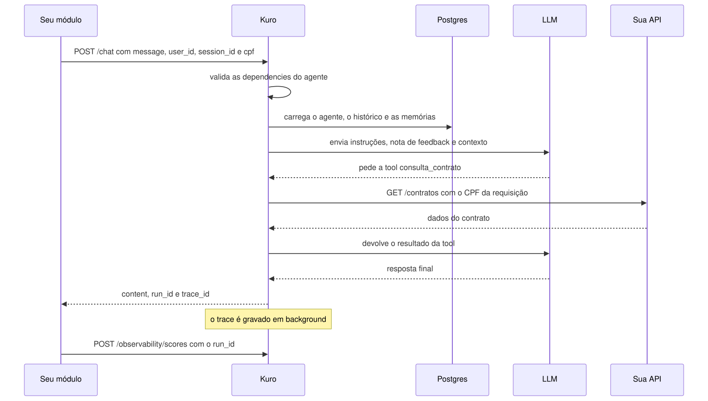

# Kuro · agent-service

**Agentes de IA prontos para produção, entregues como um microserviço.**
Você descreve o agente em JSON, e o Kuro devolve uma API estável para os outros
módulos da sua plataforma, com versões de prompt, tools sem código, base de
conhecimento, memória e observabilidade de cada execução.

Pensado para ser operado **por pessoas e por outros agentes de IA**: um Claude
Code consegue criar, testar e depurar um agente inteiro pelo terminal, em
poucas linhas.

```bash
uv run kuro agents apply -f suporte.json      # cria o agente
uv run kuro chat suporte                      # conversa com ele
uv run kuro runs list --agent suporte         # vê o que aconteceu, com tokens e custo
```

---

## Por que o Kuro

| | |
|---|---|
| 🧩 **Um contrato, muitos agentes** | `POST /chat` é igual para qualquer agente. Criar ou editar um agente não exige deploy nem restart. |
| 🔒 **O modelo não escolhe dado sensível** | O CPF usado numa chamada à sua API vem da requisição, injetado pelo servidor. O modelo não consegue inventar nem trocar o valor, nem ser induzido a consultar o CPF de outra pessoa. |
| 🛠️ **Tools sem escrever código** | Descreva uma API HTTP em JSON e ela vira uma tool. Também há toolkits prontas do Agno. |
| 🕰️ **Tudo versionado** | Cada mudança de prompt gera uma versão, com diff no console. Cada execução registra a versão que respondeu. |
| 🔍 **Cada execução explicada** | Chamadas ao modelo, tools, tokens, latência e custo de cada run, pelo console, pela CLI ou pela API. |
| 📈 **Melhora com o uso** | O feedback do admin sobre uma conversa vira uma regra que o agente segue nas próximas. |
| 🤖 **Feito para agentes operarem** | CLI com `--json`, códigos de saída previsíveis e nenhum prompt interativo sem TTY. Receitas em [AGENTS.md](AGENTS.md). |

## Três portas para o mesmo serviço

<picture>
  <source media="(prefers-color-scheme: dark)" srcset="docs/diagramas/tres-portas-escuro.svg">
  
</picture>

- **API** para integrar: o contrato estável que os outros módulos chamam.
- **CLI (`kuro`)** para operar e corrigir, por humanos ou por IAs.
- **Console web** para inspecionar quando precisar: playground, logs e edição visual.

As três fazem a mesma coisa. Não há operação que só exista numa delas — o que
se configura pelo console dá para configurar pela CLI, e vice-versa:

| O que | API | CLI | Console |
|---|---|---|---|
| Agentes: listar, ver, criar, editar, excluir | `/agents` | `agents list\|get\|apply\|set\|delete` | Agentes |
| Versões do prompt e rollback | `/agents/{t}/versions` | `agents versions\|rollback` | aba Versões |
| O que o agente aprendeu (regras de feedback) | `/agents/{t}/feedback` | `agents feedback` | aba Aprendizado |
| Histórico das regras e rollback | `/agents/{t}/feedback/versions` | `agents feedback --versions\|--rollback` | aba Aprendizado |
| Contrato de integração | `/agents/{t}/integration` | `agents integrate` | aba Integração |
| Conversar (com anexos) | `/chat`, `/chat/stream` | `chat`, `chat -a` | Playground |
| Analisar documento | `/analyze` | `analyze` | Análise |
| Tools: CRUD, catálogo, invocar | `/tools` | `tools ...` | Tools |
| Testar tool com `dependencies` | `/tools/{n}/invoke` | `tools invoke -d` | Testar tool |
| Collections: CRUD e busca | `/collections` | `collections ...` | Conhecimento |
| Embedder de cada collection | `/collections/embedders` | `collections embedders` | diálogo nova coleção |
| Indexar texto e arquivo | `/collections/{n}/documents`, `/files` | `collections add`, `add -f` | abas Texto e Arquivo |
| Listar e apagar documento indexado | `/collections/{n}/documents` | `collections docs\|rm-doc` | tabela da coleção |
| Provedores e credenciais de modelo | `/model-providers`, `/model-credentials` | `providers`, `credentials` | Chaves de API |
| Execuções, traces e scores | `/observability/*` | `runs ...` | Logs |
| Conversas salvas, renomear e apagar | `/sessions` | `sessions list\|show\|rename\|delete` | Conversas |

Três exceções, e as três são limitações reais e não esquecimento:
**indexar por URL** só funciona na coleção padrão (é o pipeline do AgentOS que
não aceita escolher a coleção); **`runs tail`**, que acompanha execuções ao
vivo, existe só na CLI (no console, a lista de Logs atualiza sozinha); e
**testar uma chave de API antes de salvá-la** existe só no console, porque na
CLI o caminho é cadastrar e rodar `credentials test`.

---

## Comece em 5 minutos

**Pré-requisitos:** Docker e uma chave do Google Gemini.

```bash
cp .env.example .env
# edite o .env: GOOGLE_API_KEY=... e CREDENTIALS_ENCRYPTION_KEY=...
# gere a chave de cifra com:
#   python -c "from cryptography.fernet import Fernet; print(Fernet.generate_key().decode())"

docker compose up -d --build                       # núcleo: postgres, redis, agent-service
uv run kuro health                                 # serviço, autenticação, Langfuse, provedores
```

O núcleo sobe sozinho. Console e observabilidade são **opcionais**, cada um num
profile do Compose — o peso real é o Langfuse (ClickHouse + MinIO + Redis +
worker, ~16 GB recomendados), e quem só quer terminal não precisa dele:

```bash
docker compose --profile ui up -d                              # + console web
LANGFUSE_ENABLED=true docker compose --profile ui --profile observability up -d   # tudo
```

> Com o profile `observability` fora, `LANGFUSE_ENABLED` fica `false` por padrão.
> Sem isso o serviço continuaria instrumentando e cada execução tentaria exportar
> para um host que não existe — 20 s de timeout por run.

| Serviço | Endereço | Profile | Para quê |
|---|---|---|---|
| API | http://127.0.0.1:58000 | (núcleo) | contrato de integração; `/docs` tem o OpenAPI |
| Postgres | `127.0.0.1:55432` | (núcleo) | pgvector; porta fora do padrão para não colidir |
| Redis | `127.0.0.1:6379` | (núcleo) | mensageria |
| Console | http://localhost:3000 | `ui` | playground, agentes, tools, base de conhecimento, logs |
| Langfuse | http://localhost:3100 | `observability` | traces, tokens e custo por execução |

As portas são publicadas **só em `127.0.0.1`**. Para expor numa rede, não mude
`AGENT_SERVICE_BIND`: suba o profile `tls`, que põe HTTPS na frente.

### HTTPS (profile `tls`)

A chave de API viaja num header. Em HTTP puro ela vai em texto claro no fio,
junto com as mensagens do cliente — para um serviço chamado por outra
plataforma, isso não serve. O profile `tls` sobe um [Caddy](https://caddyserver.com)
na frente, que resolve certificado e renovação sozinho:

```bash
# no .env: KURO_API_DOMAIN=kuro.suaempresa.com e KURO_TLS_EMAIL=voce@suaempresa.com
docker compose --profile tls up -d
```

Com o domínio apontando para a máquina e as portas 80/443 alcançáveis, o
certificado é emitido pelo Let's Encrypt no primeiro acesso e renovado antes de
vencer. A porta 80 precisa ficar aberta: é por onde a validação acontece e por
onde o `http://` é redirecionado para `https://`.

Deixando `KURO_API_DOMAIN=localhost` (o padrão), o Caddy usa uma CA interna — dá
para testar a configuração inteira sem domínio nenhum. A CLI, nesse caso, não vai
confiar no certificado; use `--insecure` **só nesse teste**, ou aponte a CA com
`KURO_CA_BUNDLE=/caminho/ca.pem` se a sua rede tem CA própria.

O `58000` continua publicado em `127.0.0.1` para a CLI local. Quem vem de fora
entra pelo 443.

> **Windows:** use `127.0.0.1` para a API, não `localhost`. Com o Docker
> Desktop, `localhost:58000` pode tentar IPv6 primeiro e travar por 30 s.

**Crie e teste o primeiro agente:**

```bash
uv run kuro agents apply -f - <<'EOF'
{
  "agent_type": "suporte",
  "name": "Agente de Suporte",
  "instructions": ["Você é um agente de suporte técnico.", "Responda de forma objetiva."]
}
EOF

uv run kuro chat suporte -m "meu wifi caiu"
```

Ou pela API, de qualquer linguagem:

```bash
curl -X POST http://127.0.0.1:58000/chat -H "Content-Type: application/json" \
  -d '{"agent_type": "suporte", "user_id": "u1", "session_id": "s1", "message": "meu wifi caiu"}'
```

> **Máquina com pouca RAM?** O Langfuse self-hosted (ClickHouse, MinIO, Redis
> e dois serviços) pede ~16 GB. Numa máquina de 8 GB ele sozinho deixou as
> respostas 4x mais lentas. Para testar, suba só o núcleo e desligue o tracing
> (`LANGFUSE_ENABLED=false` no `.env`):
> `docker compose up -d postgres redis agent-service frontend`.

---

## Como uma mensagem é processada

<picture>
  <source media="(prefers-color-scheme: dark)" srcset="docs/diagramas/fluxo-do-chat-escuro.svg">
  
</picture>

---

## Conceitos

### Agentes

Um agente é uma linha no Postgres, não código. Crie pela API, pela CLI ou
pelo console, e ele responde **na próxima requisição**.

| Tipo (`kind`) | Endpoint | Para quê | Saída |
|---|---|---|---|
| `conversational` (padrão) | `POST /chat`, `POST /chat/stream` | atendimento, assistentes | texto, com histórico e memória |
| `analysis` | `POST /analyze` | análise de documento, extração, classificação | **JSON validado** contra o `response_schema` |

```bash
# agente analista: devolve um objeto, não texto
uv run kuro agents apply -f - <<'EOF'
{"agent_type": "extrator-contrato", "name": "Extrator de contrato",
 "instructions": ["Extraia os campos do contrato."], "kind": "analysis",
 "response_schema": [{"name": "valor", "type": "number", "required": true},
                     {"name": "prazo_dias", "type": "integer"}]}
EOF

uv run kuro analyze extrator-contrato -a contrato.pdf    # → valor: 1200.0, prazo_dias: 30
```

O `analyze` é **sobre texto**: `document` é uma string comum, então `-m "texto"`,
`-f qualquer.json`, `-f doc.txt` ou stdin já servem — o histórico de uma conversa
em JSON, por exemplo. O `--attach` é o caminho opcional, para mandar um PDF ou
uma imagem direto ao modelo sem extrair o texto antes.

**A saída pode ser aninhada.** Além dos campos simples (`string`, `integer`,
`number`, `boolean`), o `response_schema` aceita `object` (com `fields`) e
`array` (com `items`) — é o que permite extrair uma lista de itens, e não só
campos soltos:

```json
{"name": "parcelas", "type": "array",
 "items": {"type": "object", "fields": [{"name": "numero", "type": "integer", "required": true},
                                        {"name": "valor",  "type": "number",  "required": true}]}}
```

`fields` e `items` são obrigatórios nos seus tipos: sem eles o JSON Schema sai
como `{"type": "object"}` ou `"items": {}`, que os provedores recusam em saída
estruturada — seria aceito no cadastro e falharia em toda chamada.

Campos de um agente: `agent_type` (slug), `name`, `instructions`, `tools`,
`model_provider`, `model_id`, `model_credential_id`, `knowledge_collection`,
`dependency_fields`, `memory_backend`, `num_history_runs`, `kind` e
`response_schema`. O agente `conversational` é criado automaticamente no
primeiro boot.

> Num agente `analysis`, `num_history_runs` e `memory_backend` não fazem nada —
> ele é one-shot, sem sessão, histórico nem memória — e a nota de feedback não
> se aplica (ela só orienta agentes conversacionais). Mandar qualquer um deles
> dá 422, em vez de aceitar calado algo que não teria efeito.

#### Versões e melhoria contínua

<picture>
  <source media="(prefers-color-scheme: dark)" srcset="docs/diagramas/versoes-e-feedback-escuro.svg">
  
</picture>

- **Versões:** cada mudança em `instructions` grava uma versão nova. O console
  mostra o diff contra a atual e permite "restaurar no editor", que publica o
  texto antigo como versão nova. Mudar nome, tools ou modelo não gera versão.
- **Nota de feedback:** `uv run kuro agents feedback suporte -m "..."` junta o
  comentário com as regras anteriores numa nota em markdown, que passa a
  valer nas respostas seguintes (`uv run kuro agents feedback suporte --show`).

### Tools

Uma tabela, três formatos:

| `kind` | O que é | Você fornece |
|---|---|---|
| `builtin` | Toolkit pronta do Agno: busca na web, calculadora, Hacker News, e-mail, arquivos... | `builtin_id` e parâmetros |
| `api` | Qualquer API HTTP, **sem código** | método, URL, parâmetros e autenticação |
| `python` | Uma função Python sua | código e função de entrada (desligado por padrão, ver [Segurança](#segurança-e-limitações-atuais)) |

**De onde vem cada parâmetro** é o que torna as tools de API seguras:

<picture>
  <source media="(prefers-color-scheme: dark)" srcset="docs/diagramas/origem-dos-parametros-escuro.svg">
  
</picture>

- `model` (padrão): o modelo preenche. Só esses parâmetros aparecem no schema dele.
- `dependency`: o servidor injeta `dependencies[<campo>]` da requisição. O
  parâmetro fica fora do schema da tool, então o modelo não consegue
  inventá-lo nem trocá-lo.
- `const`: valor fixo.

> **Atenção:** hoje todas as `dependencies` enviadas também entram no contexto
> do modelo, como informação para personalizar a resposta. O `source:
> "dependency"` protege **qual** valor vai na chamada, não esconde o valor do
> modelo. Se o dado não pode chegar ao provedor de LLM, não o envie em
> `dependencies` (esconder campo por campo está no roadmap).

Um parâmetro que o modelo preenche e é `object` precisa declarar `fields`, e
`array` precisa de `items` — mesmo vocabulário do `response_schema`. Sem eles a
tool seria declarada ao modelo como um tipo pelado, que o provedor recusa; o
cadastro falha com 422 em vez de a tool quebrar só na hora de usar.

`required` é cobrado antes da chamada HTTP. E o Kuro mantém a consistência
nos dois sentidos: um agente só salva se declarar em `dependency_fields` os
campos que suas tools exigem, e uma tool não pode passar a exigir um campo que
algum agente em uso não declara.

```bash
# uma tool de API em uma requisição
curl -X POST http://127.0.0.1:58000/tools -H "Content-Type: application/json" -d '{
  "tool_name": "cep", "kind": "api", "label": "Consulta de CEP",
  "config": {"method": "GET", "url": "https://viacep.com.br/ws/{cep}/json/",
             "parameters": [{"name": "cep", "type": "string", "location": "path", "required": true}]}
}'

uv run kuro tools invoke cep -a cep=01310-100          # testa sem montar agente
uv run kuro agents set suporte tools='["cep"]'          # liga ao agente
```

Segredos (token, senha) voltam mascarados nas leituras, e editar sem mexer no
campo mascarado preserva o valor salvo. Uma tool em uso por algum agente não
pode ser excluída. O seed cria `calculator`, `hackernews` e `cat_fact`.
A builtin `web_search` precisa do extra `tools` (`uv sync --extra tools`); as
demais do catálogo (`calculator`, `hackernews`, `reasoning`, `email`, `files`,
`pubmed`, `openweather`, `file_generation`, `sleep`) funcionam sem instalar nada.

**Para onde uma tool pode falar.** Dentro do container, `http://postgres:5432`,
o Redis e o metadata da nuvem (`http://169.254.169.254/`) estão a um pulo de
distância — e parte da URL pode vir do modelo, quando um parâmetro é
`location: "path"`. Por isso o destino de toda tool é resolvido e conferido
antes de cada chamada: só endereços públicos passam. Vale também para o
`httpx` das tools `kind="python"`, que sem isso seria o desvio óbvio.

```bash
# um serviço interno legítimo se libera por host
TOOL_EGRESS_ALLOWLIST=faturamento.interno,10.0.0.5
```

Salvar uma tool apontando para um destino interno falha com 422, e uma chamada
recusada devolve o motivo ao modelo em vez de estourar. Toolkits do Agno que
buscam uma URL escolhida na hora (`CustomApiTools`, `WebsiteTools`) ficam fora
do catálogo de propósito: elas têm cliente HTTP próprio e passariam por cima
dessa trava — quem cobre esse caso são as tools `kind="api"`.

### Base de conhecimento (RAG)

Uma *collection* é uma base de documentos com tabela pgvector própria. O
agente que aponta para ela em `knowledge_collection` ganha uma tool de busca e
decide sozinho quando consultar.

```bash
uv run kuro collections create manuais --label "Manuais do produto"
cat manual.txt | uv run kuro collections add manuais --title "Manual v2"
uv run kuro collections search manuais "prazo de garantia"      # o mesmo que o agente enxerga
uv run kuro agents set suporte knowledge_collection=manuais
```

O console também aceita upload de arquivo e URL, com chunking e processamento
assíncrono (pipeline do AgentOS), por enquanto só na coleção padrão (`general`).
Nas demais, use texto.

#### Quem gera os vetores

Cada collection escolhe o seu embedder **na criação**, entre `google` (padrão),
`openai` e `ollama` — a chave sai de `/model-credentials`, a mesma dos modelos
(o `google` ainda aceita a `GOOGLE_API_KEY` do `.env`). Com `ollama` o RAG não
precisa de chave de API nenhuma e nada sai da máquina.

```bash
uv run kuro collections embedders                 # quem está pronto e quem falta credencial
uv run kuro collections create interna --label "Interna" --embedder ollama
```

O embedder não muda depois: a tabela `knowledge_<nome>` guarda vetores de uma
largura e de uma semântica só, então trocá-lo não daria erro — daria busca
silenciosamente errada. Para trocar, crie outra collection e reindexe. Um
`--embedder-model` fora do padrão do provedor pede também
`--embedder-dimensions`, pelo mesmo motivo. Collections criadas antes disto
continuam no Gemini, sem reindexar.

### Memória

| Camada | Alcance | Como liga |
|---|---|---|
| Histórico da sessão | a conversa atual (`session_id`) | sempre, `num_history_runs` mensagens |
| Memória de longo prazo (Agno) | o usuário (`user_id`), entre sessões | `memory_backend: "common"` (padrão) |
| Memória de longo prazo (Mem0) | o usuário, com busca semântica | `memory_backend: "mem0"`, que **substitui** a do Agno |

Com `common`, o próprio modelo decide o que guardar sobre o usuário e grava no
Postgres. Com `mem0`, o Mem0 busca as memórias relevantes antes de responder e
grava depois. Ele exige `uv sync --extra mem0`, `MEM0_ENABLED=true` e
`MEM0_API_KEY`; a imagem Docker não inclui o extra por padrão. Sem essa
configuração o agente responde normalmente, mas sem memória de longo prazo,
e o erro aparece só no log.

### Modelos e credenciais

Gemini funciona com a `GOOGLE_API_KEY` do `.env`. OpenAI, Anthropic e Ollama
(e chaves extras do Google) são cadastrados em runtime, pelo console em
**Modelos** ou pela CLI:

```bash
uv run kuro providers list
KEY=sk-... uv run kuro credentials add -p openai -l "Produção" --api-key-env KEY
uv run kuro credentials test <credential_id>     # valida sem gastar tokens de geração
uv run kuro agents set suporte model_provider=openai model_id=gpt-4.1-mini
```

As chaves ficam **cifradas em repouso** (Fernet, `CREDENTIALS_ENCRYPTION_KEY`)
e nunca voltam numa resposta, só os 4 últimos caracteres. Sem a chave de
cifra, salvar falha em vez de gravar em texto plano. Cada agente pode fixar
uma credencial (`model_credential_id`) ou usar a padrão do provedor. OpenAI e
Ollama aceitam `base_url` próprio (gateway compatível ou self-hosted).
Pela API: `GET /model-providers` e `GET/POST/PUT/DELETE /model-credentials`,
com `POST /model-credentials/{id}/test`.

### Anexos

`/chat` e `/analyze` aceitam imagem, áudio, vídeo e arquivos (PDF, DOCX, CSV...)
em `attachments: [{content_base64 | url, mime_type, filename}]`, até
`MAX_ATTACHMENT_MB` (20) cada. O modelo do agente precisa suportar o tipo (o
Gemini suporta). Na CLI: `-a arquivo.pdf`, repetível. Em conversas o anexo
fica no histórico da sessão, então para arquivos grandes prefira `analyze`.

---

## Integrar com outro módulo

Cada agente publica o próprio contrato: endpoint, corpo, `dependencies`
obrigatórias e exemplos. A documentação sai dos dados e não fica desatualizada.

```bash
uv run kuro agents integrate suporte       # ou GET /agents/suporte/integration
```

| Endpoint | Uso |
|---|---|
| `POST /chat` | resposta completa: `{content, run_id, trace_id, session_id}` |
| `POST /chat/stream` | SSE via POST. Eventos: `run` (ids), `message` (trechos), `usage` (tokens), `error`, `done` |
| `POST /analyze` | agente `analysis`, sem sessão: `{result: {...}}` |
| `POST /observability/scores` | feedback de um run: `{run_id, name: "feedback", value: 1, user_id}` |

O streaming é POST porque a mensagem vai no corpo e não na URL. No navegador,
consuma com `fetch` e leia o `ReadableStream` (o `EventSource` só faz GET).
As `dependencies` são validadas contra os `dependency_fields` do agente e
entram no contexto do modelo; as tools as recebem via `source: "dependency"`.

---

## Operar pelo terminal: `kuro`

Tudo o que o console faz, você também faz pelo terminal. A CLI conversa com a
API em `http://127.0.0.1:58000` (mude com `--url` ou `KURO_API_URL`) e não
precisa de banco local.

### O shell do Kuro

Rode `uv run kuro` sem argumentos e você entra num shell com menus. A `/` é
opcional, e qualquer comando da CLI funciona lá dentro:

```text
$ uv run kuro
kuro · http://127.0.0.1:58000 · /help para comandos
kuro> /agents
? Agente:  suporte  —  Agente de Suporte
? Agente de Suporte (suporte):
  » Testar (chat)
    Testar em sessão nova
    Ver definição
    Editar no editor
    Histórico do prompt
    Restaurar uma versão do prompt
    Remover
```

| No shell | O que faz |
|---|---|
| `/agents` | escolhe um agente e abre as ações: testar, ver, editar, versões, restaurar, remover |
| `/chat <agente>` | conversa direto com o agente |
| `/analyze <agente>` | analisa um documento com um agente `analysis` |
| `/agents feedback <agente>` | ensina o agente a partir da última conversa |
| `/agents integrate <agente>` | mostra como outro módulo chama o agente |
| `/tools` | escolhe uma tool para ver e invocar |
| `/collections` | bases de conhecimento |
| `/runs` · `/runs show <run_id>` | execuções recentes e o detalhe de uma |
| `/runs tail` · `/runs stats` | execuções ao vivo e o resumo com custo |
| `/sessions` · `/sessions show <id>` | conversas guardadas e a transcrição de uma |
| `/providers` · `/credentials` | provedores e chaves de modelo |
| `/health` | diagnóstico do serviço |
| `/help` · `/sair` | ajuda e saída |

### O dia a dia, comando a comando

**Criar e ajustar um agente**

```bash
uv run kuro agents apply -f suporte.json        # cria ou atualiza a partir de um arquivo
uv run kuro agents edit suporte                 # abre a definição no seu $EDITOR e salva o que mudar
uv run kuro agents set suporte num_history_runs=5 tools='["cep"]'   # muda só esses campos
uv run kuro agents versions suporte             # histórico do prompt
uv run kuro agents rollback suporte 3           # volta as instructions para as da v3
```

**Testar**

```bash
uv run kuro chat suporte                        # conversa contínua; /nova troca de sessão, /sair volta
uv run kuro chat suporte -m "meu wifi caiu" -d cpf=12345678900     # uma mensagem, com dependencies
uv run kuro chat suporte -m "o que tem nessa foto?" -a foto.png    # com anexo
uv run kuro analyze extrator-contrato -a contrato.pdf              # agente analista
```

A sessão do chat fica salva por agente, então mensagens seguidas continuam a
mesma conversa. Use `--new-session` para recomeçar.

**Ensinar com feedback**

```bash
uv run kuro agents feedback suporte -m "deveria confirmar o CPF antes de dar detalhes"
uv run kuro agents feedback suporte --show      # a nota que o agente segue agora
```

**Investigar o que aconteceu**

```bash
uv run kuro runs list --agent suporte           # execuções com latência, tokens, custo e status
uv run kuro runs show <run_id>                  # chamadas ao modelo, tools e avaliações
uv run kuro runs score <run_id> 1 --comment "resposta correta"
uv run kuro runs tail --agent suporte           # acompanha as execuções ao vivo (Ctrl+C sai)
uv run kuro runs stats --agent suporte          # total, erros, tokens, custo e série diária
uv run kuro sessions list                       # conversas guardadas deste user_id
uv run kuro sessions show <session_id>          # a transcrição, mensagem a mensagem
```

`runs` lê os traces do Langfuse; `sessions` lê a conversa no Postgres, então
funciona mesmo com o tracing desligado.

**Tools, conhecimento e modelos**

```bash
uv run kuro tools                               # escolhe uma tool e invoca
uv run kuro tools invoke calculator --fn add -a a=2 -a b=3
uv run kuro tools apply -f cep.json             # cria ou atualiza uma tool
uv run kuro tools set cep enabled=false         # muda só esses campos
uv run kuro collections search manuais "prazo de garantia"
uv run kuro credentials test <credential_id>    # valida a chave sem gastar tokens
uv run kuro health                              # serviço, Langfuse e provedores
```

Qualquer comando aceita `--help`, por exemplo `uv run kuro chat --help`.

> **Dica:** instale com `uv tool install -e .` para chamar só `kuro` de
> qualquer pasta, e com a inicialização mais rápida.

**Manutenção no servidor, sem console.** A CLI já vem instalada na imagem, com
a URL e a chave configuradas — dá para operar tudo de dentro do container:

```bash
docker compose exec agent-service kuro health
docker compose exec agent-service kuro --json agents list
docker compose exec -it agent-service kuro            # shell interativo
```

Fora do servidor, aponte a CLI com as duas variáveis:

```bash
export KURO_API_URL=https://kuro.interno
export KURO_API_KEY=...        # a ADMIN_API_KEY
uv run kuro health
```

### Para agentes de IA e scripts

A mesma CLI funciona sem ninguém no teclado: `--json` devolve dados no stdout
e erros em JSON no stderr, os códigos de saída são previsíveis (`0` sucesso,
`1` falha, `2` uso incorreto, `3` serviço inacessível) e `--no-input` garante
que nada fica esperando resposta. As receitas estão em **[AGENTS.md](AGENTS.md)**.

---

## Console web

| Página | O que tem |
|---|---|
| **Playground** `/chat` | conversa em streaming com qualquer agente conversacional; URL por conversa, histórico reidratado; edição de `dependencies`; anexos; 👍/👎 — e o 👎 pergunta o que mudar e ensina o agente |
| **Análise** `/analyze` | roda um agente analista: documento (ou anexo) entra, o objeto do `response_schema` sai |
| **Agentes** `/agents` | configuração (só os campos alterados vão no `PUT`), tipo do agente e editor da saída estruturada, versões com diff, **Aprendizado** (as regras vindas de feedback, editáveis, com histórico e rollback), execuções, conversas e a aba Integração com o contrato vindo do backend |
| **Tools** `/tools` | criação e edição dos três tipos, com formulário próprio por tipo, campos de dentro de parâmetros `object`/`array`, botão **Testar** (com `dependencies`) e origem de cada parâmetro |
| **Conhecimento** `/knowledge` | documentos com status, escolha do embedder na criação, upload por texto ou arquivo em qualquer coleção (URL só na padrão), teste de busca semântica |
| **Modelos** `/models` | credenciais por provedor, teste de chave |
| **Logs** `/logs` | sessões e execuções de todos os agentes, KPIs, gráfico diário; cada sessão e cada run abrem em detalhe |
| **Trace** `/runs/[id]` | cascata de spans (agente → modelo → tools), prompt formatado, tokens, custo e avaliações |

Atalhos: `Ctrl/⌘+K` (paleta de comandos) e `Ctrl/⌘+B` (recolher a sidebar).
Tema claro, escuro ou do sistema.

O navegador só fala com o Next.js. Os Route Handlers em `frontend/src/app/api/**`
fazem proxy para o `agent-service` usando `AGENT_SERVICE_URL`, que só existe no
servidor: sem CORS e sem expor o backend. Não há login no MVP: o `user_id` do
console fica no `localStorage` do navegador.

---

## Observabilidade

<picture>
  <source media="(prefers-color-scheme: dark)" srcset="docs/diagramas/observabilidade-escuro.svg">
  
</picture>

Cada run registra a mensagem, as `dependencies`, cada chamada ao modelo
(prompt, resposta, tokens, latência, custo) e cada tool call, com `user_id`,
`session_id`, agente e `prompt-v{N}`. O `run_id` é gerado antes do run, então
toda resposta aponta para o próprio trace. O envio não atrasa a resposta, e
com o Langfuse fora do ar os runs seguem normais, só sem rastreio.

```bash
uv run kuro runs list --agent suporte -n 5            # latência, tokens, custo, 👍/👎
uv run kuro runs show <run_id>                        # spans e scores
curl "http://127.0.0.1:58000/observability/runs?status=error&limit=20"
curl "http://127.0.0.1:58000/observability/sessions?limit=50"
curl "http://127.0.0.1:58000/observability/stats?agent_type=suporte"
```

Filtros: `agent_type`, `prompt_version`, `status` (`success`/`error`/`interrupted`),
`user_id`, `session_id`, `since`/`until` (ISO 8601), `limit` (≤ 100) e `cursor`.
Um run leva alguns segundos para aparecer (a ingestão é assíncrona).
`/sessions` e `/stats` agregam em memória um lote das execuções recentes (o
campo `scanned` diz quantas), porque a API do Langfuse não agrupa por sessão
nem por dia.

O Langfuse roda no compose como armazenamento interno: ninguém precisa abrir
a UI dele. Se precisar, ela fica em `http://localhost:3100`, só na máquina
local (login em `LANGFUSE_INIT_USER_EMAIL`/`LANGFUSE_INIT_USER_PASSWORD`). Para
usar o Langfuse Cloud, remova os serviços `langfuse-*` do compose e aponte
`LANGFUSE_BASE_URL=https://cloud.langfuse.com`. Troque todos os valores
marcados `CHANGEME` no compose em qualquer ambiente que não seja a sua máquina.

---

## Arquitetura

<picture>
  <source media="(prefers-color-scheme: dark)" srcset="docs/diagramas/arquitetura-escuro.svg">
  
</picture>

```
src/agent_service/
  api/            contrato estável (/chat, /chat/stream, /analyze) e CRUD de agentes, tools, collections, credenciais, observabilidade
  agents/         store (definições + versões + nota de feedback), registry (resolução em runtime), anexos, dependências
  tools/          store, catálogo de builtins, tools de API e Python, resolução
  models/         catálogo de provedores, credenciais cifradas, criação do modelo
  memory/         memória comum (Agno) e Mem0
  documents/      collections de documentos (pgvector)
  observability/  tracing (Langfuse + OpenTelemetry) e leitura de traces
  messaging/      Redis Streams (produtor; consumidor ainda não ligado)
  cli/            CLI kuro
  main.py         FastAPI + AgentOS
frontend/         console Next.js (App Router, Tailwind, componentes próprios em components/ui/)
tests/            pytest
```

**Stack:** Python 3.12, [Agno](https://docs.agno.com) (agentes, memória, tools,
knowledge) e [AgentOS](https://docs.agno.com/agent-os) (sessões e ingestão),
FastAPI, PostgreSQL + pgvector, Redis Streams, Langfuse, Next.js + TypeScript +
Tailwind, Docker Compose.

---

## Configuração

| Variável | Padrão | Para quê |
|---|---|---|
| `ADMIN_API_KEY` / `RUNTIME_API_KEY` | — | chaves de API; **sem elas o serviço fica aberto** |
| `KURO_API_DOMAIN` / `KURO_TLS_EMAIL` | `localhost` / — | domínio e e-mail do certificado (profile `tls`) |
| `AGENT_SERVICE_BIND` | `127.0.0.1:58000` | onde a API é publicada no host |
| `LANGFUSE_ENABLED` | `false` | ligue junto com o profile `observability` |
| `GOOGLE_API_KEY` | — | chave do Gemini (provedor padrão) |
| `CREDENTIALS_ENCRYPTION_KEY` | — | chave Fernet que cifra as credenciais de modelo; **obrigatória** para cadastrar chaves |
| `DEFAULT_MODEL_PROVIDER` / `DEFAULT_MODEL_ID` | `google` / `gemini-2.5-flash` | modelo de quem não define um |
| `DATABASE_URL` / `REDIS_URL` | localhost | sobrescritos dentro do compose |
| `MAX_ATTACHMENT_MB` | `20` | limite por anexo |
| `MAX_INPUT_CHARS` | `200000` | teto do texto de entrada (`message` do `/chat`, `document` do `/analyze`) |
| `CUSTOM_PYTHON_TOOLS_ENABLED` | `false` | liga a execução de tools `python` |
| `TOOL_EGRESS_ALLOWLIST` | — | hosts internos que as tools podem alcançar (vazio = só endereços públicos) |
| `MEM0_ENABLED` / `MEM0_API_KEY` | `false` / — | habilita agentes com `memory_backend: "mem0"` |
| `LANGFUSE_ENABLED` | `false` | liga o tracing — suba junto o profile `observability` |
| `LANGFUSE_PUBLIC_KEY` / `LANGFUSE_SECRET_KEY` / `LANGFUSE_BASE_URL` | valores de dev | conexão com o Langfuse |
| `LANGFUSE_TIMEOUT_SECONDS` | `20` | timeout do envio de traces |
| `AGENT_SERVICE_URL` (frontend) | — | endereço interno da API, só no servidor Next.js |
| `AGENT_SERVICE_PUBLIC_URL` (frontend) | — | endereço exibido nos exemplos de integração |
| `KURO_API_URL` / `KURO_JSON` / `KURO_NO_INPUT` (CLI) | `http://127.0.0.1:58000` | endereço, saída JSON e modo não interativo |

---

## Desenvolvimento

```bash
# backend fora do Docker (precisa de postgres e redis do compose rodando)
docker compose up -d postgres redis
uv sync
uv run uvicorn agent_service.main:app --app-dir src --reload

# frontend
cd frontend && npm install
AGENT_SERVICE_URL=http://127.0.0.1:58000 npm run dev

# testes
uv run pytest
```

Não há migrações: o schema é criado no startup (`create_all`), e colunas novas
entram por `ALTER TABLE` em cada `store.py`.

**Diagramas:** as fontes ficam em `docs/diagramas/*.mmd` e o README exibe os
SVGs gerados a partir delas (uma versão clara e uma escura), porque o
renderizador de Mermaid do GitHub falha de forma intermitente. Depois de editar
um `.mmd`, regenere os dois SVGs:

```bash
npx -p @mermaid-js/mermaid-cli mmdc -i docs/diagramas/arquitetura.mmd -o docs/diagramas/arquitetura-claro.svg -t default -b transparent -c docs/diagramas/mermaid.json
npx -p @mermaid-js/mermaid-cli mmdc -i docs/diagramas/arquitetura.mmd -o docs/diagramas/arquitetura-escuro.svg -t dark -b transparent -c docs/diagramas/mermaid.json
uv run python docs/diagramas/fixar-tamanho.py    # grava o tamanho real, para o GitHub não esticar a imagem
```

---

## Segurança e limitações atuais

Leia antes de expor o serviço fora de uma rede confiável:

- **Autenticação: defina as duas chaves antes de sair da sua máquina.**
  `ADMIN_API_KEY` e `RUNTIME_API_KEY` no `.env`. Sem elas o serviço fica aberto
  (comportamento de antes, para não quebrar quem roda local) e quem alcança a
  porta lê toda conversa que passou por ali (`/observability/runs`, `/sessions`),
  reescreve o prompt de um agente em produção e lê as credenciais de modelo.
  `kuro health` mostra em vermelho quando está aberto.

  | Escopo | Alcança | Quem usa |
  |---|---|---|
  | `RUNTIME_API_KEY` | `/chat`, `/chat/stream`, `/analyze`, scores | os outros módulos da plataforma |
  | `ADMIN_API_KEY` | tudo: CRUD, traces, sessões, credenciais | console e CLI (`KURO_API_KEY`) |

  A chave de runtime é a que você entrega para fora: se vazar, o estrago é gastar
  token — não ler o histórico de todo mundo nem trocar o prompt. Rotacionar é
  trocar a variável e reiniciar; várias chaves com revogação é o passo seguinte.

  O escopo `runtime` alcança exatamente quatro rotas: `/chat`, `/chat/stream`,
  `/analyze` e `POST /observability/scores`. Todo o resto exige `admin`. Com auth
  ligada, `/docs` e `/openapi.json` também exigem `admin` — publicar a superfície
  inteira da API para quem alcança a porta seria entregar o mapa antes da
  fechadura; para ler o OpenAPI, mande o header. `GET /health` fica sempre
  aberta, porque é o healthcheck do container.
- **Tools `python` não são uma sandbox.** O namespace é restrito (imports
  liberados, nomes perigosos bloqueados), mas isso barra erro e abuso
  acidental, não um autor mal-intencionado. Por isso vêm desligadas.
- **Use o profile `tls` fora da sua máquina.** A chave de API vai num header:
  sem HTTPS, ela e as mensagens do cliente trafegam em texto claro. Ver
  [HTTPS](#https-profile-tls). O serviço em si fala HTTP — quem termina o TLS é
  o Caddy na frente.
- **Tools só alcançam endereços públicos.** O destino é resolvido e conferido
  antes de cada chamada, nos dois caminhos de rede (`kind="api"` e o `httpx` das
  tools Python). Libere um host interno legítimo em `TOOL_EGRESS_ALLOWLIST`.
  Limite conhecido: DNS rebinding — para isso, política de saída no ambiente.
- **Agentes e collections criados depois do boot** funcionam no `/chat` na
  hora, mas só aparecem nas rotas nativas do AgentOS (e no playground de
  os.agno.com) depois de um restart.
- **Mem0 hospedado** envia as mensagens dos usuários para os servidores do Mem0.
- **Langfuse self-hosted é pesado** (~16 GB recomendados). Ver
  [Comece em 5 minutos](#comece-em-5-minutos) para rodar sem ele.

---

## Roadmap

O plano completo, com diagnóstico, prioridades e o que cortar, está em
**[ROADMAP.md](ROADMAP.md)**. Os próximos passos:

- **Fundação:** autenticação por API key com escopos (`runtime`/`admin`),
  bloqueio de IPs internos nas tools de API, Alembic, CI e `tenant_id` antes de existirem dados.
- **Leve por padrão:** Docker Compose profiles (`ui`, `observability`) e
  observabilidade em Postgres atrás do `TraceStore`, com o Langfuse como
  destino OTLP opcional. Medido em 2026-09-18: numa máquina de 7,3 GB, um "oi"
  levava 22 s com o Langfuse local e 5,3 s sem ele.
- **Mais rápido:** thinking do Gemini configurável por agente (1,33 s → 0,86 s
  medido), menos chamadas ao modelo no RAG, agentes montados no boot, import
  preguiçoso na CLI.
- **Agente procedural:** fluxos em etapas (coletar, confirmar, executar) com a
  máquina de estados no servidor e o estado da etapa devolvido no `/chat`.
- **Validado de verdade:** versão da configuração inteira, canais `draft`/`prod`,
  `kuro eval` para comparar versões com execuções reais, servidor MCP e agentes como código.
- **Dependências privadas:** marcar campos de `dependencies` que as tools
  usam mas que nunca entram no prompt do modelo.
- **Memória:** modos explícitos por agente (`none`, `auto`, `agentic`, `mem0`),
  limite de memórias no prompt, rota para apagar as memórias de um usuário (LGPD)
  e Mem0 sem falha silenciosa.
