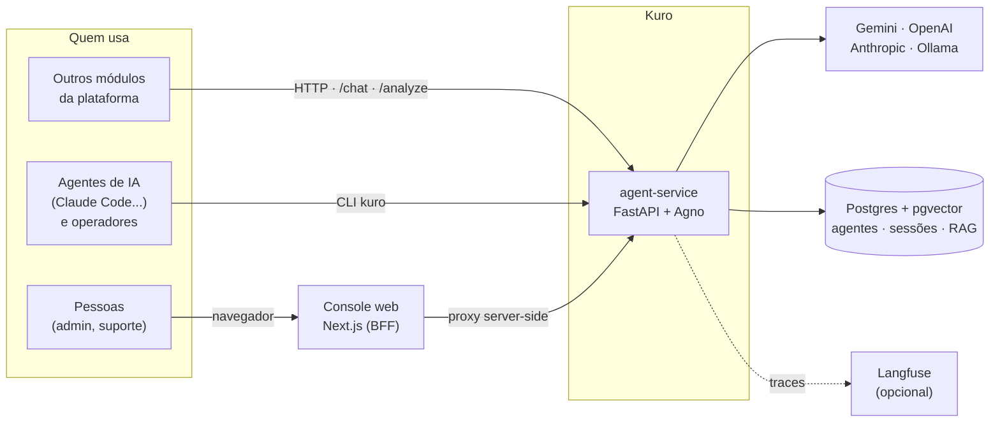
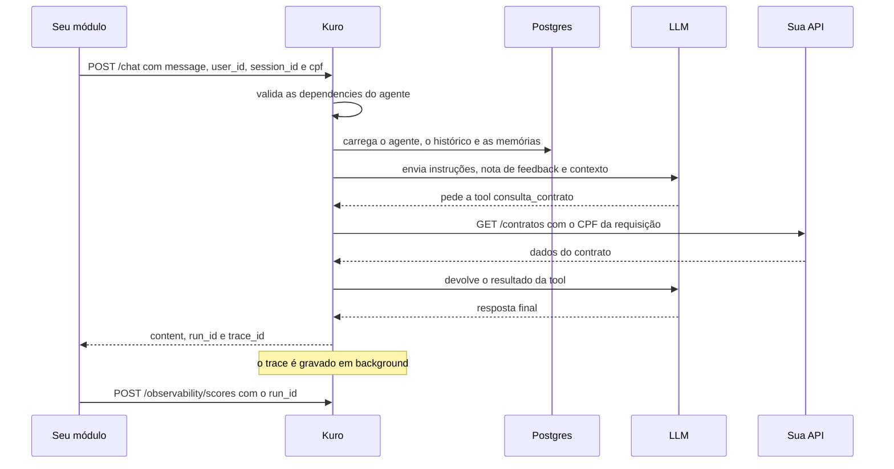
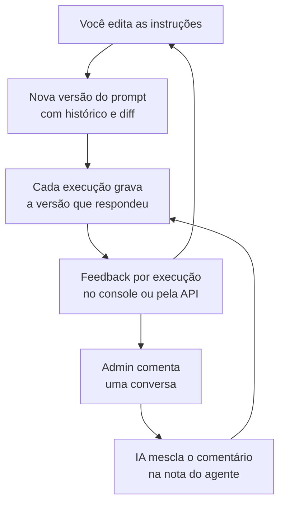
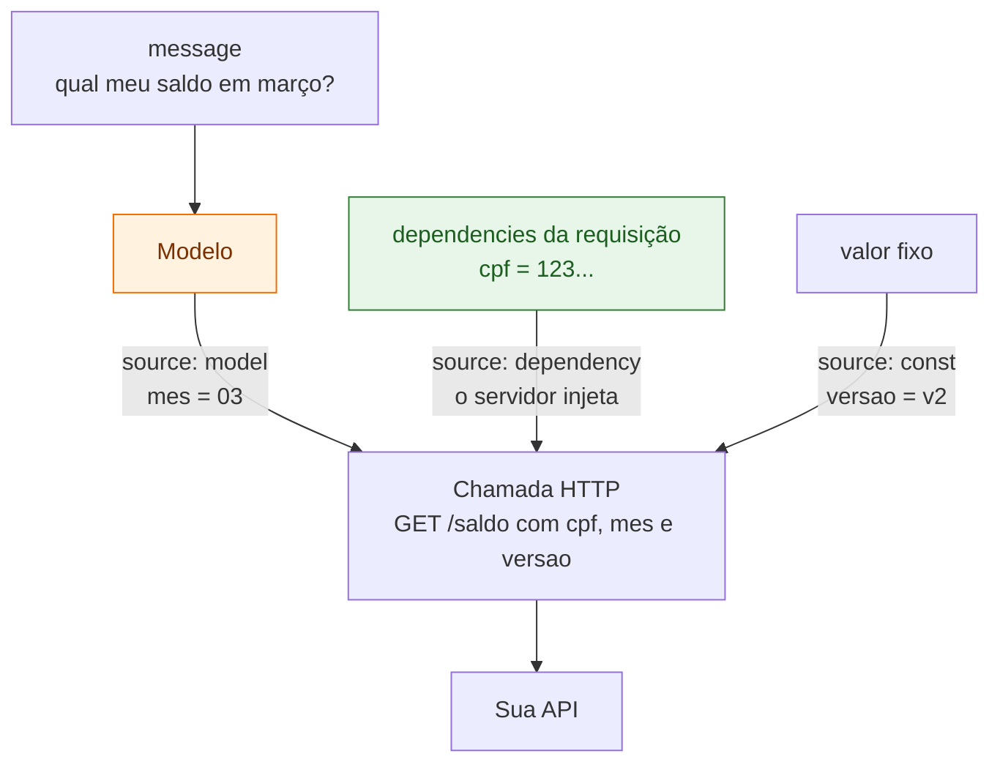
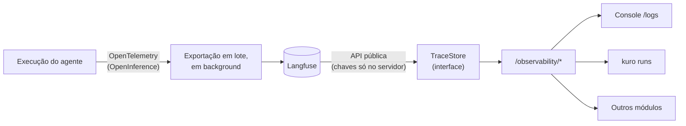
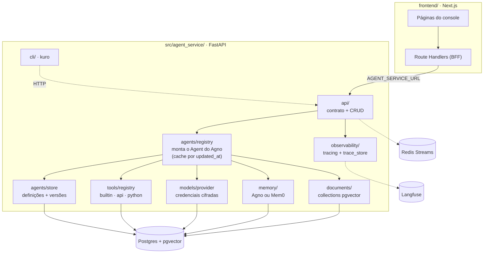

# Kuro · agent-service

**Agentes de IA prontos para produção, entregues como um microserviço.**
Você descreve o agente em JSON, e o Kuro devolve uma API estável para os outros
módulos da sua plataforma, com versões de prompt, tools sem código, base de
conhecimento, memória e observabilidade de cada execução.

Pensado para ser operado **por pessoas e por outros agentes de IA**: um Claude
Code consegue criar, testar e depurar um agente inteiro pelo terminal, em
poucas linhas.

```bash
uv run kuro agents apply -f suporte.json      # cria o agente
uv run kuro chat suporte                      # conversa com ele
uv run kuro runs list --agent suporte         # vê o que aconteceu, com tokens e custo
```

---

## Por que o Kuro

| | |
|---|---|
| 🧩 **Um contrato, muitos agentes** | `POST /chat` é igual para qualquer agente. Criar ou editar um agente não exige deploy nem restart. |
| 🔒 **O modelo não escolhe dado sensível** | O CPF usado numa chamada à sua API vem da requisição, injetado pelo servidor. O modelo não consegue inventar nem trocar o valor, nem ser induzido a consultar o CPF de outra pessoa. |
| 🛠️ **Tools sem escrever código** | Descreva uma API HTTP em JSON e ela vira uma tool. Também há toolkits prontas do Agno. |
| 🕰️ **Tudo versionado** | Cada mudança de prompt gera uma versão, com diff no console. Cada execução registra a versão que respondeu. |
| 🔍 **Cada execução explicada** | Chamadas ao modelo, tools, tokens, latência e custo de cada run, pelo console, pela CLI ou pela API. |
| 📈 **Melhora com o uso** | O feedback do admin sobre uma conversa vira uma regra que o agente segue nas próximas. |
| 🤖 **Feito para agentes operarem** | CLI com `--json`, códigos de saída previsíveis e nenhum prompt interativo sem TTY. Receitas em [AGENTS.md](AGENTS.md). |

## Três portas para o mesmo serviço



- **API** para integrar: o contrato estável que os outros módulos chamam.
- **CLI (`kuro`)** para operar e corrigir, por humanos ou por IAs.
- **Console web** para inspecionar quando precisar: playground, logs e edição visual.

---

## Comece em 5 minutos

**Pré-requisitos:** Docker e uma chave do Google Gemini.

```bash
cp .env.example .env
# edite o .env: GOOGLE_API_KEY=... e CREDENTIALS_ENCRYPTION_KEY=...
# gere a chave de cifra com:
#   python -c "from cryptography.fernet import Fernet; print(Fernet.generate_key().decode())"

docker compose up -d --build
uv run kuro health          # serviço, Langfuse e provedores de modelo
```

| Serviço | Endereço | Para quê |
|---|---|---|
| Console | http://localhost:3000 | playground, agentes, tools, base de conhecimento, logs |
| API | http://127.0.0.1:58000 | contrato de integração; `/docs` tem o OpenAPI |
| Postgres | `127.0.0.1:55432` | pgvector; porta fora do padrão para não colidir |
| Redis | `127.0.0.1:6379` | mensageria |

> **Windows:** use `127.0.0.1` para a API, não `localhost`. Com o Docker
> Desktop, `localhost:58000` pode tentar IPv6 primeiro e travar por 30 s.

**Crie e teste o primeiro agente:**

```bash
uv run kuro agents apply -f - <<'EOF'
{
  "agent_type": "suporte",
  "name": "Agente de Suporte",
  "instructions": ["Você é um agente de suporte técnico.", "Responda de forma objetiva."]
}
EOF

uv run kuro chat suporte -m "meu wifi caiu"
```

Ou pela API, de qualquer linguagem:

```bash
curl -X POST http://127.0.0.1:58000/chat -H "Content-Type: application/json" \
  -d '{"agent_type": "suporte", "user_id": "u1", "session_id": "s1", "message": "meu wifi caiu"}'
```

> **Máquina com pouca RAM?** O Langfuse self-hosted (ClickHouse, MinIO, Redis
> e dois serviços) pede ~16 GB. Numa máquina de 8 GB ele sozinho deixou as
> respostas 4x mais lentas. Para testar, suba só o núcleo e desligue o tracing
> (`LANGFUSE_ENABLED=false` no `.env`):
> `docker compose up -d postgres redis agent-service frontend`.

---

## Como uma mensagem é processada



---

## Conceitos

### Agentes

Um agente é uma linha no Postgres, não código. Crie pela API, pela CLI ou
pelo console, e ele responde **na próxima requisição**.

| Tipo (`kind`) | Endpoint | Para quê | Saída |
|---|---|---|---|
| `conversational` (padrão) | `POST /chat`, `POST /chat/stream` | atendimento, assistentes | texto, com histórico e memória |
| `analysis` | `POST /analyze` | análise de documento, extração, classificação | **JSON validado** contra o `response_schema` |

```bash
# agente analista: devolve um objeto, não texto
uv run kuro agents apply -f - <<'EOF'
{"agent_type": "extrator-contrato", "name": "Extrator de contrato",
 "instructions": ["Extraia os campos do contrato."], "kind": "analysis",
 "response_schema": [{"name": "valor", "type": "number", "required": true},
                     {"name": "prazo_dias", "type": "integer"}]}
EOF

uv run kuro analyze extrator-contrato -a contrato.pdf    # → valor: 1200.0, prazo_dias: 30
```

Campos de um agente: `agent_type` (slug), `name`, `instructions`, `tools`,
`model_provider`, `model_id`, `model_credential_id`, `knowledge_collection`,
`dependency_fields`, `memory_backend`, `num_history_runs`, `kind` e
`response_schema`. O agente `conversational` é criado automaticamente no
primeiro boot.

#### Versões e melhoria contínua



- **Versões:** cada mudança em `instructions` grava uma versão nova. O console
  mostra o diff contra a atual e permite "restaurar no editor", que publica o
  texto antigo como versão nova. Mudar nome, tools ou modelo não gera versão.
- **Nota de feedback:** `uv run kuro agents feedback suporte -m "..."` junta o
  comentário com as regras anteriores numa nota em markdown, que passa a
  valer nas respostas seguintes (`uv run kuro agents feedback suporte --show`).

### Tools

Uma tabela, três formatos:

| `kind` | O que é | Você fornece |
|---|---|---|
| `builtin` | Toolkit pronta do Agno: busca na web, calculadora, Hacker News, e-mail, arquivos... | `builtin_id` e parâmetros |
| `api` | Qualquer API HTTP, **sem código** | método, URL, parâmetros e autenticação |
| `python` | Uma função Python sua | código e função de entrada (desligado por padrão, ver [Segurança](#segurança-e-limitações-atuais)) |

**De onde vem cada parâmetro** é o que torna as tools de API seguras:



- `model` (padrão): o modelo preenche. Só esses parâmetros aparecem no schema dele.
- `dependency`: o servidor injeta `dependencies[<campo>]` da requisição. O
  parâmetro fica fora do schema da tool, então o modelo não consegue
  inventá-lo nem trocá-lo.
- `const`: valor fixo.

> **Atenção:** hoje todas as `dependencies` enviadas também entram no contexto
> do modelo, como informação para personalizar a resposta. O `source:
> "dependency"` protege **qual** valor vai na chamada, não esconde o valor do
> modelo. Se o dado não pode chegar ao provedor de LLM, não o envie em
> `dependencies` (esconder campo por campo está no roadmap).

`required` é cobrado antes da chamada HTTP. E o Kuro mantém a consistência
nos dois sentidos: um agente só salva se declarar em `dependency_fields` os
campos que suas tools exigem, e uma tool não pode passar a exigir um campo que
algum agente em uso não declara.

```bash
# uma tool de API em uma requisição
curl -X POST http://127.0.0.1:58000/tools -H "Content-Type: application/json" -d '{
  "tool_name": "cep", "kind": "api", "label": "Consulta de CEP",
  "config": {"method": "GET", "url": "https://viacep.com.br/ws/{cep}/json/",
             "parameters": [{"name": "cep", "type": "string", "location": "path", "required": true}]}
}'

uv run kuro tools invoke cep -a cep=01310-100          # testa sem montar agente
uv run kuro agents set suporte tools='["cep"]'          # liga ao agente
```

Segredos (token, senha) voltam mascarados nas leituras, e editar sem mexer no
campo mascarado preserva o valor salvo. Uma tool em uso por algum agente não
pode ser excluída. O seed cria `calculator`, `hackernews` e `cat_fact`.
A builtin `web_search` precisa do extra `tools` (`uv sync --extra tools`).

### Base de conhecimento (RAG)

Uma *collection* é uma base de documentos com tabela pgvector própria. O
agente que aponta para ela em `knowledge_collection` ganha uma tool de busca e
decide sozinho quando consultar.

```bash
uv run kuro collections create manuais --label "Manuais do produto"
cat manual.txt | uv run kuro collections add manuais --title "Manual v2"
uv run kuro collections search manuais "prazo de garantia"      # o mesmo que o agente enxerga
uv run kuro agents set suporte knowledge_collection=manuais
```

O console também aceita upload de arquivo e URL, com chunking e processamento
assíncrono (pipeline do AgentOS), por enquanto só na coleção padrão (`general`).
Nas demais, use texto.

### Memória

| Camada | Alcance | Como liga |
|---|---|---|
| Histórico da sessão | a conversa atual (`session_id`) | sempre, `num_history_runs` mensagens |
| Memória de longo prazo (Agno) | o usuário (`user_id`), entre sessões | `memory_backend: "common"` (padrão) |
| Memória de longo prazo (Mem0) | o usuário, com busca semântica | `memory_backend: "mem0"`, que **substitui** a do Agno |

Com `common`, o próprio modelo decide o que guardar sobre o usuário e grava no
Postgres. Com `mem0`, o Mem0 busca as memórias relevantes antes de responder e
grava depois. Ele exige `uv sync --extra mem0`, `MEM0_ENABLED=true` e
`MEM0_API_KEY`; a imagem Docker não inclui o extra por padrão. Sem essa
configuração o agente responde normalmente, mas sem memória de longo prazo,
e o erro aparece só no log.

### Modelos e credenciais

Gemini funciona com a `GOOGLE_API_KEY` do `.env`. OpenAI, Anthropic e Ollama
(e chaves extras do Google) são cadastrados em runtime, pelo console em
**Modelos** ou pela CLI:

```bash
uv run kuro providers list
KEY=sk-... uv run kuro credentials add -p openai -l "Produção" --api-key-env KEY
uv run kuro credentials test <credential_id>     # valida sem gastar tokens de geração
uv run kuro agents set suporte model_provider=openai model_id=gpt-4.1-mini
```

As chaves ficam **cifradas em repouso** (Fernet, `CREDENTIALS_ENCRYPTION_KEY`)
e nunca voltam numa resposta, só os 4 últimos caracteres. Sem a chave de
cifra, salvar falha em vez de gravar em texto plano. Cada agente pode fixar
uma credencial (`model_credential_id`) ou usar a padrão do provedor. OpenAI e
Ollama aceitam `base_url` próprio (gateway compatível ou self-hosted).
Pela API: `GET /model-providers` e `GET/POST/PUT/DELETE /model-credentials`,
com `POST /model-credentials/{id}/test`.

### Anexos

`/chat` e `/analyze` aceitam imagem, áudio, vídeo e arquivos (PDF, DOCX, CSV...)
em `attachments: [{content_base64 | url, mime_type, filename}]`, até
`MAX_ATTACHMENT_MB` (20) cada. O modelo do agente precisa suportar o tipo (o
Gemini suporta). Na CLI: `-a arquivo.pdf`, repetível. Em conversas o anexo
fica no histórico da sessão, então para arquivos grandes prefira `analyze`.

---

## Integrar com outro módulo

Cada agente publica o próprio contrato: endpoint, corpo, `dependencies`
obrigatórias e exemplos. A documentação sai dos dados e não fica desatualizada.

```bash
uv run kuro agents integrate suporte       # ou GET /agents/suporte/integration
```

| Endpoint | Uso |
|---|---|
| `POST /chat` | resposta completa: `{content, run_id, trace_id, session_id}` |
| `POST /chat/stream` | SSE via POST. Eventos: `run` (ids), `message` (trechos), `usage` (tokens), `error`, `done` |
| `POST /analyze` | agente `analysis`, sem sessão: `{result: {...}}` |
| `POST /observability/scores` | feedback de um run: `{run_id, name: "feedback", value: 1, user_id}` |

O streaming é POST porque a mensagem vai no corpo e não na URL. No navegador,
consuma com `fetch` e leia o `ReadableStream` (o `EventSource` só faz GET).
As `dependencies` são validadas contra os `dependency_fields` do agente e
entram no contexto do modelo; as tools as recebem via `source: "dependency"`.

---

## Operar pelo terminal: `kuro`

Tudo o que o console faz, você também faz pelo terminal. A CLI conversa com a
API em `http://127.0.0.1:58000` (mude com `--url` ou `KURO_API_URL`) e não
precisa de banco local.

### O shell do Kuro

Rode `uv run kuro` sem argumentos e você entra num shell com menus. A `/` é
opcional, e qualquer comando da CLI funciona lá dentro:

```text
$ uv run kuro
kuro · http://127.0.0.1:58000 · /help para comandos
kuro> /agents
? Agente:  suporte  —  Agente de Suporte
? Agente de Suporte (suporte):
  » Testar (chat)
    Testar em sessão nova
    Ver definição
    Editar no editor
    Histórico do prompt
    Remover
```

| No shell | O que faz |
|---|---|
| `/agents` | escolhe um agente e abre as ações: testar, ver, editar, versões, remover |
| `/chat <agente>` | conversa direto com o agente |
| `/analyze <agente>` | analisa um documento com um agente `analysis` |
| `/agents feedback <agente>` | ensina o agente a partir da última conversa |
| `/agents integrate <agente>` | mostra como outro módulo chama o agente |
| `/tools` | escolhe uma tool para ver e invocar |
| `/collections` | bases de conhecimento |
| `/runs` · `/runs show <run_id>` | execuções recentes e o detalhe de uma |
| `/providers` · `/credentials` | provedores e chaves de modelo |
| `/health` | diagnóstico do serviço |
| `/help` · `/sair` | ajuda e saída |

### O dia a dia, comando a comando

**Criar e ajustar um agente**

```bash
uv run kuro agents apply -f suporte.json        # cria ou atualiza a partir de um arquivo
uv run kuro agents edit suporte                 # abre a definição no seu $EDITOR e salva o que mudar
uv run kuro agents set suporte num_history_runs=5 tools='["cep"]'   # muda só esses campos
uv run kuro agents versions suporte             # histórico do prompt
```

**Testar**

```bash
uv run kuro chat suporte                        # conversa contínua; /nova troca de sessão, /sair volta
uv run kuro chat suporte -m "meu wifi caiu" -d cpf=12345678900     # uma mensagem, com dependencies
uv run kuro chat suporte -m "o que tem nessa foto?" -a foto.png    # com anexo
uv run kuro analyze extrator-contrato -a contrato.pdf              # agente analista
```

A sessão do chat fica salva por agente, então mensagens seguidas continuam a
mesma conversa. Use `--new-session` para recomeçar.

**Ensinar com feedback**

```bash
uv run kuro agents feedback suporte -m "deveria confirmar o CPF antes de dar detalhes"
uv run kuro agents feedback suporte --show      # a nota que o agente segue agora
```

**Investigar o que aconteceu**

```bash
uv run kuro runs list --agent suporte           # execuções com latência, tokens, custo e status
uv run kuro runs show <run_id>                  # chamadas ao modelo, tools e avaliações
uv run kuro runs score <run_id> 1 --comment "resposta correta"
```

**Tools, conhecimento e modelos**

```bash
uv run kuro tools                               # escolhe uma tool e invoca
uv run kuro tools invoke calculator --fn add -a a=2 -a b=3
uv run kuro collections search manuais "prazo de garantia"
uv run kuro credentials test <credential_id>    # valida a chave sem gastar tokens
uv run kuro health                              # serviço, Langfuse e provedores
```

Qualquer comando aceita `--help`, por exemplo `uv run kuro chat --help`.

> **Dica:** instale com `uv tool install -e .` para chamar só `kuro` de
> qualquer pasta, e com a inicialização mais rápida.

### Para agentes de IA e scripts

A mesma CLI funciona sem ninguém no teclado: `--json` devolve dados no stdout
e erros em JSON no stderr, os códigos de saída são previsíveis (`0` sucesso,
`1` falha, `2` uso incorreto, `3` serviço inacessível) e `--no-input` garante
que nada fica esperando resposta. As receitas estão em **[AGENTS.md](AGENTS.md)**.

---

## Console web

| Página | O que tem |
|---|---|
| **Playground** `/chat` | conversa em streaming com qualquer agente; URL por conversa, histórico reidratado; edição de `dependencies`; 👍/👎; link para o trace; código de integração pronto |
| **Agentes** `/agents` | configuração (só os campos alterados vão no `PUT`), versões com diff, execuções filtráveis por versão e status, conversas, aba Integração com cURL/JS/Python |
| **Tools** `/tools` | criação e edição dos três tipos, com formulário próprio por tipo, botão **Testar** e origem de cada parâmetro |
| **Conhecimento** `/knowledge` | documentos com status, upload por texto, arquivo ou URL, teste de busca semântica |
| **Modelos** `/models` | credenciais por provedor, teste de chave |
| **Logs** `/logs` | sessões e execuções de todos os agentes, KPIs, gráfico diário; cada sessão e cada run abrem em detalhe |
| **Trace** `/runs/[id]` | cascata de spans (agente → modelo → tools), prompt formatado, tokens, custo e avaliações |

Atalhos: `Ctrl/⌘+K` (paleta de comandos) e `Ctrl/⌘+B` (recolher a sidebar).
Tema claro, escuro ou do sistema.

O navegador só fala com o Next.js. Os Route Handlers em `frontend/src/app/api/**`
fazem proxy para o `agent-service` usando `AGENT_SERVICE_URL`, que só existe no
servidor: sem CORS e sem expor o backend. Não há login no MVP: o `user_id` do
console fica no `localStorage` do navegador.

---

## Observabilidade



Cada run registra a mensagem, as `dependencies`, cada chamada ao modelo
(prompt, resposta, tokens, latência, custo) e cada tool call, com `user_id`,
`session_id`, agente e `prompt-v{N}`. O `run_id` é gerado antes do run, então
toda resposta aponta para o próprio trace. O envio não atrasa a resposta, e
com o Langfuse fora do ar os runs seguem normais, só sem rastreio.

```bash
uv run kuro runs list --agent suporte -n 5            # latência, tokens, custo, 👍/👎
uv run kuro runs show <run_id>                        # spans e scores
curl "http://127.0.0.1:58000/observability/runs?status=error&limit=20"
curl "http://127.0.0.1:58000/observability/sessions?limit=50"
curl "http://127.0.0.1:58000/observability/stats?agent_type=suporte"
```

Filtros: `agent_type`, `prompt_version`, `status` (`success`/`error`/`interrupted`),
`user_id`, `session_id`, `since`/`until` (ISO 8601), `limit` (≤ 100) e `cursor`.
Um run leva alguns segundos para aparecer (a ingestão é assíncrona).
`/sessions` e `/stats` agregam em memória um lote das execuções recentes (o
campo `scanned` diz quantas), porque a API do Langfuse não agrupa por sessão
nem por dia.

O Langfuse roda no compose como armazenamento interno: ninguém precisa abrir
a UI dele. Se precisar, ela fica em `http://localhost:3100`, só na máquina
local (login em `LANGFUSE_INIT_USER_EMAIL`/`LANGFUSE_INIT_USER_PASSWORD`). Para
usar o Langfuse Cloud, remova os serviços `langfuse-*` do compose e aponte
`LANGFUSE_BASE_URL=https://cloud.langfuse.com`. Troque todos os valores
marcados `CHANGEME` no compose em qualquer ambiente que não seja a sua máquina.

---

## Arquitetura



```
src/agent_service/
  api/            contrato estável (/chat, /chat/stream, /analyze) e CRUD de agentes, tools, collections, credenciais, observabilidade
  agents/         store (definições + versões + nota de feedback), registry (resolução em runtime), anexos, dependências
  tools/          store, catálogo de builtins, tools de API e Python, resolução
  models/         catálogo de provedores, credenciais cifradas, criação do modelo
  memory/         memória comum (Agno) e Mem0
  documents/      collections de documentos (pgvector)
  observability/  tracing (Langfuse + OpenTelemetry) e leitura de traces
  messaging/      Redis Streams (produtor; consumidor ainda não ligado)
  cli/            CLI kuro
  main.py         FastAPI + AgentOS
frontend/         console Next.js (App Router, Tailwind, componentes próprios em components/ui/)
tests/            pytest
```

**Stack:** Python 3.12, [Agno](https://docs.agno.com) (agentes, memória, tools,
knowledge) e [AgentOS](https://docs.agno.com/agent-os) (sessões e ingestão),
FastAPI, PostgreSQL + pgvector, Redis Streams, Langfuse, Next.js + TypeScript +
Tailwind, Docker Compose.

---

## Configuração

| Variável | Padrão | Para quê |
|---|---|---|
| `GOOGLE_API_KEY` | — | chave do Gemini (provedor padrão) |
| `CREDENTIALS_ENCRYPTION_KEY` | — | chave Fernet que cifra as credenciais de modelo; **obrigatória** para cadastrar chaves |
| `DEFAULT_MODEL_PROVIDER` / `DEFAULT_MODEL_ID` | `google` / `gemini-2.5-flash` | modelo de quem não define um |
| `DATABASE_URL` / `REDIS_URL` | localhost | sobrescritos dentro do compose |
| `MAX_ATTACHMENT_MB` | `20` | limite por anexo |
| `CUSTOM_PYTHON_TOOLS_ENABLED` | `false` | liga a execução de tools `python` |
| `MEM0_ENABLED` / `MEM0_API_KEY` | `false` / — | habilita agentes com `memory_backend: "mem0"` |
| `LANGFUSE_ENABLED` | `true` | liga o tracing |
| `LANGFUSE_PUBLIC_KEY` / `LANGFUSE_SECRET_KEY` / `LANGFUSE_BASE_URL` | valores de dev | conexão com o Langfuse |
| `LANGFUSE_TIMEOUT_SECONDS` | `20` | timeout do envio de traces |
| `AGENT_SERVICE_URL` (frontend) | — | endereço interno da API, só no servidor Next.js |
| `AGENT_SERVICE_PUBLIC_URL` (frontend) | — | endereço exibido nos exemplos de integração |
| `KURO_API_URL` / `KURO_JSON` / `KURO_NO_INPUT` (CLI) | `http://127.0.0.1:58000` | endereço, saída JSON e modo não interativo |

---

## Desenvolvimento

```bash
# backend fora do Docker (precisa de postgres e redis do compose rodando)
docker compose up -d postgres redis
uv sync
uv run uvicorn agent_service.main:app --app-dir src --reload

# frontend
cd frontend && npm install
AGENT_SERVICE_URL=http://127.0.0.1:58000 npm run dev

# testes
uv run pytest
```

Não há migrações: o schema é criado no startup (`create_all`), e colunas novas
entram por `ALTER TABLE` em cada `store.py`.

---

## Segurança e limitações atuais

Leia antes de expor o serviço fora de uma rede confiável:

- **Sem autenticação.** Qualquer cliente que alcança a API pode editar agentes
  e ler traces. Rode em rede interna até a autenticação chegar (ver roadmap).
- **Tools `python` não são uma sandbox.** O namespace é restrito (imports
  liberados, nomes perigosos bloqueados), mas isso barra erro e abuso
  acidental, não um autor mal-intencionado. Por isso vêm desligadas.
- **Tools `api` chamam qualquer URL `http(s)`**, inclusive endereços internos.
  Só dê acesso de edição de tools a quem é confiável.
- **Agentes e collections criados depois do boot** funcionam no `/chat` na
  hora, mas só aparecem nas rotas nativas do AgentOS (e no playground de
  os.agno.com) depois de um restart.
- **Mem0 hospedado** envia as mensagens dos usuários para os servidores do Mem0.
- **Langfuse self-hosted é pesado** (~16 GB recomendados). Ver
  [Comece em 5 minutos](#comece-em-5-minutos) para rodar sem ele.

---

## Roadmap

O plano completo, com diagnóstico, prioridades e o que cortar, está em
**[ROADMAP.md](ROADMAP.md)**. Os próximos passos:

- **Fundação:** autenticação por API key com escopos (`runtime`/`admin`),
  bloqueio de IPs internos nas tools de API, Alembic, CI e `tenant_id` antes de existirem dados.
- **Leve por padrão:** Docker Compose profiles (`ui`, `observability`) e
  observabilidade em Postgres atrás do `TraceStore`, com o Langfuse como
  destino OTLP opcional. Medido em 2026-09-18: numa máquina de 7,3 GB, um "oi"
  levava 22 s com o Langfuse local e 5,3 s sem ele.
- **Mais rápido:** thinking do Gemini configurável por agente (1,33 s → 0,86 s
  medido), menos chamadas ao modelo no RAG, agentes montados no boot, import
  preguiçoso na CLI.
- **Agente procedural:** fluxos em etapas (coletar, confirmar, executar) com a
  máquina de estados no servidor e o estado da etapa devolvido no `/chat`.
- **Validado de verdade:** versão da configuração inteira, canais `draft`/`prod`,
  `kuro eval` para comparar versões com execuções reais, servidor MCP e agentes como código.
- **Dependências privadas:** marcar campos de `dependencies` que as tools
  usam mas que nunca entram no prompt do modelo.
- **Memória:** modos explícitos por agente (`none`, `auto`, `agentic`, `mem0`),
  limite de memórias no prompt, rota para apagar as memórias de um usuário (LGPD)
  e Mem0 sem falha silenciosa.
