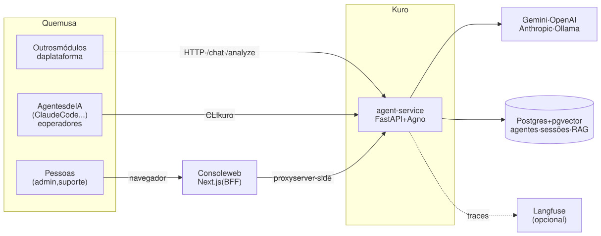

# Kuro · agent-service

**Agentes de IA prontos para produção, entregues como um microserviço.**
Você descreve o agente em JSON, e o Kuro devolve uma API estável para os outros
módulos da sua plataforma, com versões de prompt, tools sem código, base de
conhecimento, memória e observabilidade de cada execução.

Pensado para ser operado **por pessoas e por outros agentes de IA**: um Claude
Code consegue criar, testar e depurar um agente inteiro pelo terminal, em
poucas linhas.

```bash
uv run kuro agents apply -f suporte.json      # cria o agente
uv run kuro chat suporte                      # conversa com ele
uv run kuro runs list --agent suporte         # vê o que aconteceu, com tokens e custo
```

---

## Por que o Kuro

| | |
|---|---|
| 🧩 **Um contrato, muitos agentes** | `POST /chat` é igual para qualquer agente. Criar ou editar um agente não exige deploy nem restart. |
| 🔒 **O modelo não escolhe dado sensível** | O CPF usado numa chamada à sua API vem da requisição, injetado pelo servidor. O modelo não consegue inventar nem trocar o valor, nem ser induzido a consultar o CPF de outra pessoa. |
| 🛠️ **Tools sem escrever código** | Descreva uma API HTTP em JSON e ela vira uma tool. Também há toolkits prontas do Agno. |
| 🕰️ **Tudo versionado** | Cada mudança de prompt, modelo, parâmetros, tools, schema ou regras gera uma versão da configuração. Cada execução registra a versão que respondeu. |
| ✅ **Mudança provada antes de publicar** | Draft → `kuro eval` → promote, e modo shadow para comparar com o agente que já existe antes de trocar. |
| 🔍 **Cada execução explicada** | Chamadas ao modelo, tools, tokens, latência e custo de cada run, pelo console, pela CLI ou pela API. |
| 📈 **Melhora com o uso** | O feedback do admin sobre uma conversa vira uma regra que o agente segue nas próximas. |
| 🤖 **Feito para agentes operarem** | Um [servidor MCP](docs/mcp.md) com as operações da CLI como tools, e ações destrutivas confirmadas pela pessoa. Ou a própria CLI, com `--json`, códigos de saída previsíveis e nenhum prompt interativo sem TTY. Receitas em [AGENTS.md](AGENTS.md). |

## Três portas para o mesmo serviço

<picture>
  <source media="(prefers-color-scheme: dark)" srcset="docs/diagramas/tres-portas-escuro.svg">
  
</picture>

- **API** para integrar: o contrato estável que os outros módulos chamam.
- **CLI (`kuro`)** para operar e corrigir, por humanos ou por IAs. Inclui o
  [`kuro dash`](docs/tui.md), um painel em tela cheia com as execuções ao vivo, e
  vem acompanhada do [servidor MCP (`kuro-mcp`)](docs/mcp.md), que dá as mesmas
  operações a agentes de IA como tools.
- **Console web** para inspecionar quando precisar: playground, logs e edição visual.

As três fazem a mesma coisa. A [matriz de paridade](docs/cli.md#paridade-entre-api-cli-e-console)
lista cada operação e as poucas exceções, com o motivo.

---

## Comece em 5 minutos

**Pré-requisitos:** Docker e uma chave do Google Gemini. O passo a passo completo, com o painel
no terminal e o MCP, está no [quickstart](docs/quickstart.md).

```bash
cp .env.example .env
# edite o .env: GOOGLE_API_KEY=... e CREDENTIALS_ENCRYPTION_KEY=...
# gere a chave de cifra com:
#   python -c "from cryptography.fernet import Fernet; print(Fernet.generate_key().decode())"

docker compose up -d --build                       # núcleo: postgres, agent-service
uv run kuro health                                 # serviço, autenticação, Langfuse, provedores
```

A API fica em http://127.0.0.1:58000 (`/docs` tem o OpenAPI). O console web e o
Langfuse são opcionais, cada um num profile do Compose; portas, HTTPS e
variáveis estão em [operação](docs/operacao.md).

**Crie e teste o primeiro agente:**

```bash
uv run kuro agents apply -f - <<'EOF'
{
  "agent_type": "suporte",
  "name": "Agente de Suporte",
  "instructions": ["Você é um agente de suporte técnico.", "Responda de forma objetiva."]
}
EOF

uv run kuro chat suporte -m "meu wifi caiu"
```

Ou pela API, de qualquer linguagem:

```bash
curl -X POST http://127.0.0.1:58000/chat -H "Content-Type: application/json" \
  -d '{"agent_type": "suporte", "user_id": "u1", "session_id": "s1", "message": "meu wifi caiu"}'
```

> **Windows:** use `127.0.0.1` para a API, não `localhost`. Com o Docker
> Desktop, `localhost:58000` pode tentar IPv6 primeiro e travar por 30 s.

---

## Documentação

| Documento | O que tem |
|---|---|
| [docs/quickstart.md](docs/quickstart.md) | do zero ao primeiro agente, ao `kuro dash` e ao MCP, com as telas |
| [docs/conceitos.md](docs/conceitos.md) | agentes, tools, base de conhecimento (RAG), memória, modelos, anexos |
| [docs/integracao.md](docs/integracao.md) | como outro sistema chama o Kuro: contrato, erros, shadow, exemplo em PHP |
| [docs/cli.md](docs/cli.md) | o shell, os comandos e o uso por agentes de IA |
| [docs/mcp.md](docs/mcp.md) | o servidor MCP: configurar no Claude Code, as tools e a confirmação de ações destrutivas |
| [docs/tui.md](docs/tui.md) | `kuro dash`: execuções ao vivo, trace e panorama no terminal |
| [docs/console.md](docs/console.md) | o console web |
| [docs/observabilidade.md](docs/observabilidade.md) | runs, trace store, Langfuse |
| [docs/arquitetura.md](docs/arquitetura.md) | componentes, stack e o fluxo de uma mensagem |
| [docs/operacao.md](docs/operacao.md) | configuração, HTTPS, deploy, segurança e limitações |
| [docs/desenvolvimento.md](docs/desenvolvimento.md) | rodar os testes, estrutura do código, como contribuir |
| [docs/notas-de-versao.md](docs/notas-de-versao.md) | o que mudou em cada versão e como atualizar |
| [AGENTS.md](AGENTS.md) | receitas curtas da CLI para agentes de IA |

## Roadmap

O plano, com diagnóstico, prioridades e o que cortar, está em [ROADMAP.md](ROADMAP.md).
