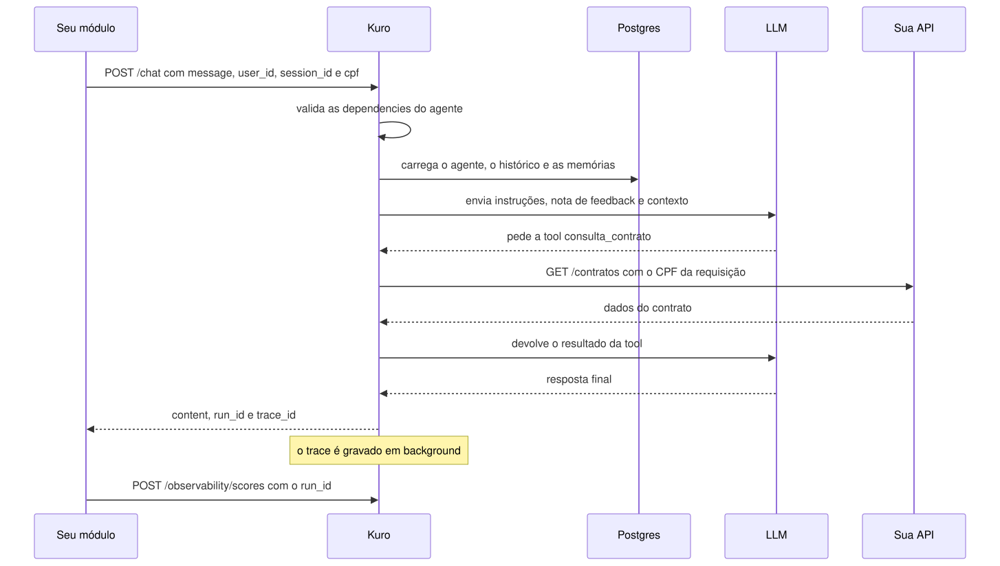

# Arquitetura

## Como uma mensagem é processada

<picture>
  <source media="(prefers-color-scheme: dark)" srcset="diagramas/fluxo-do-chat-escuro.svg">
  
</picture>

## Componentes

<picture>
  <source media="(prefers-color-scheme: dark)" srcset="diagramas/arquitetura-escuro.svg">
  
</picture>

```
src/agent_service/
  api/            contrato estável (/chat, /chat/stream, /analyze) e CRUD de agentes, tools, collections, credenciais, observabilidade
  agents/         store (definições + versões + nota de feedback), registry (resolução em runtime), anexos, dependências
  tools/          store, catálogo de builtins, tools de API e Python, resolução
  models/         catálogo de provedores, credenciais cifradas, criação do modelo
  memory/         memória comum (Agno) e Mem0
  documents/      collections de documentos (pgvector)
  observability/  trace store local (Postgres), exportador Langfuse opcional e leitura de traces
  cli/            CLI kuro
  main.py         FastAPI + AgentOS
frontend/         console Next.js (App Router, Tailwind, componentes próprios em components/ui/)
tests/            pytest
```

**Stack:** Python 3.12, [Agno](https://docs.agno.com) (agentes, memória, tools,
knowledge) e [AgentOS](https://docs.agno.com/agent-os) (sessões e ingestão),
FastAPI, PostgreSQL + pgvector, Langfuse (opcional), Next.js + TypeScript +
Tailwind, Docker Compose.
