# Conceitos

Agentes, tools, base de conhecimento, memória, modelos e anexos: as peças com que se monta um agente no Kuro.

## Agentes

Um agente é uma linha no Postgres, não código. Crie pela API, pela CLI ou
pelo console, e ele responde **na próxima requisição**.

| Tipo (`kind`) | Endpoint | Para quê | Saída |
|---|---|---|---|
| `conversational` (padrão) | `POST /chat`, `POST /chat/stream` | atendimento, assistentes | texto, com histórico e memória |
| `analysis` | `POST /analyze` | análise de documento, extração, classificação | **JSON validado** contra o `response_schema` |
| `procedural` | `POST /chat`, `POST /chat/stream` | fluxo guiado: coletar, confirmar, executar | texto, mais o `state` da etapa ([abaixo](#agente-procedural-fluxo-em-etapas)) |

```bash
# agente analista: devolve um objeto, não texto
uv run kuro agents apply -f - <<'EOF'
{"agent_type": "extrator-contrato", "name": "Extrator de contrato",
 "instructions": ["Extraia os campos do contrato."], "kind": "analysis",
 "response_schema": [{"name": "valor", "type": "number", "required": true},
                     {"name": "prazo_dias", "type": "integer"}]}
EOF

uv run kuro analyze extrator-contrato -a contrato.pdf    # → valor: 1200.0, prazo_dias: 30
```

O `analyze` é **sobre texto**: `document` é uma string comum, então `-m "texto"`,
`-f qualquer.json`, `-f doc.txt` ou stdin já servem — o histórico de uma conversa
em JSON, por exemplo. O `--attach` é o caminho opcional, para mandar um PDF ou
uma imagem direto ao modelo sem extrair o texto antes.

**A saída pode ser aninhada.** Além dos campos simples (`string`, `integer`,
`number`, `boolean`), o `response_schema` aceita `object` (com `fields`) e
`array` (com `items`) — é o que permite extrair uma lista de itens, e não só
campos soltos:

```json
{"name": "parcelas", "type": "array",
 "items": {"type": "object", "fields": [{"name": "numero", "type": "integer", "required": true},
                                        {"name": "valor",  "type": "number",  "required": true}]}}
```

`fields` e `items` são obrigatórios nos seus tipos: sem eles o JSON Schema sai
como `{"type": "object"}` ou `"items": {}`, que os provedores recusam em saída
estruturada — seria aceito no cadastro e falharia em toda chamada.

Campos de um agente: `agent_type` (slug), `name`, `instructions`, `tools`,
`model_provider`, `model_id`, `model_credential_id`, `knowledge_collection`,
`dependency_fields`, `memory_backend`, `num_history_runs`, `kind`,
`response_schema` e `stages`. O agente `conversational` é criado automaticamente no
primeiro boot.

> Num agente `analysis`, `num_history_runs` e `memory_backend` não fazem nada —
> ele é one-shot, sem sessão, histórico nem memória — e a nota de feedback não
> se aplica (ela só orienta agentes conversacionais). Mandar qualquer um deles
> dá 422, em vez de aceitar calado algo que não teria efeito.

### Agente procedural (fluxo em etapas)

Para um atendimento guiado — abrir um chamado, uma matrícula, um reset de senha —, o agente
`procedural` declara as etapas e **quem conduz é o servidor**, não o prompt. O modelo faz só duas
coisas: extrai os valores da mensagem (saída estruturada) e redige a resposta. Avançar, voltar e
concluir são decididos pelo código (`agents/procedural.py`), e o estado de cada conversa fica numa
tabela própria (`procedure_runs`), consultável.

```bash
uv run kuro agents apply -f - <<'EOF'
{"agent_type": "abertura-chamado", "name": "Abertura de chamado", "kind": "procedural",
 "instructions": ["Você abre chamados de suporte técnico. Seja cordial e objetivo."],
 "stages": [
   {"id": "identificacao", "goal": "Identificar o cliente",
    "fields": [{"name": "cpf", "label": "CPF", "required": true, "pattern": "^\\d{11}$"},
               {"name": "nome", "label": "Nome", "required": true}]},
   {"id": "problema", "goal": "Entender o problema",
    "fields": [{"name": "categoria", "required": true, "enum": ["internet", "tv", "fatura"]},
               {"name": "descricao", "label": "Descrição", "required": true}]},
   {"id": "confirmacao", "type": "confirm", "goal": "Confira os dados do chamado:"},
   {"id": "abrir", "type": "action", "tool": "abrir_chamado"}]}
EOF

uv run kuro chat abertura-chamado -m "sou a Ana, cpf 12345678901"   # rodapé: [2/4 problema] faltando: categoria, descricao
uv run kuro agents procedures abertura-chamado                        # funil: conversas paradas em cada etapa
```

| Etapa (`type`) | O que faz |
|---|---|
| `collect` (padrão) | coleta `fields` — o formato de `dependency_fields`, com `enum` e `pattern` (regex, em texto). Fica pronta quando os obrigatórios têm valor |
| `confirm` | mostra os dados coletados e espera um sim. O texto é montado dos dados, **sem o modelo** — ele não tem como "confirmar" um dado que não coletou |
| `action` | o servidor chama a `tool` com os dados coletados (argumentos e `dependencies`, mais `idempotency_key`). Só depois de uma `confirm` |

As regras que o servidor garante:

- **A etapa atual é a primeira que ainda não está pronta.** A pessoa pode adiantar dados de
  etapas seguintes, e corrigir um dado antigo volta o fluxo para a etapa dele.
- **Todo valor extraído é revalidado** (tipo, `enum`, `pattern`). O inválido é descartado e
  aparece em `state.invalid`; o modelo explica e pede de novo.
- **Mudar um dado depois da confirmação desfaz a confirmação**, e um dado já usado por uma ação
  executada não muda mais.
- **Uma ação nunca roda duas vezes.** Ela é reservada e gravada antes da resposta. Se falhar, a
  pessoa precisa confirmar de novo para tentar outra vez. Uma segunda mensagem da mesma sessão,
  enquanto a primeira está em andamento, recebe **409**.
- **Dados que já vieram em `dependencies`** (o CPF de quem integra, por exemplo) preenchem a
  etapa de saída.
- Tool com efeito colateral não entra em `tools` de um procedural: efeito só como etapa `action`.

O `/chat` devolve `state` com a etapa, o que foi coletado, o que falta e, ao concluir (`done`), o
`result` — quem integra não precisa interpretar o texto. O contrato está em
[integracao.md](integracao.md#agente-procedural-o-estado-da-conversa). No console, a conversa
mostra a etapa atual numa faixa e as etapas no painel de detalhes; a aba Execuções do agente
mostra o funil.

> O tipo de um agente procedural não muda depois de criado, e um agente existente não vira
> procedural: as conversas em andamento têm estado guardado. Para mudar, crie outro agente.

### Versões e melhoria contínua

<picture>
  <source media="(prefers-color-scheme: dark)" srcset="diagramas/versoes-e-feedback-escuro.svg">
  
</picture>

- **Versões do prompt:** cada mudança em `instructions` grava uma versão nova. O console
  mostra o diff contra a atual e permite "restaurar no editor", que publica o
  texto antigo como versão nova.
- **Versões da configuração inteira** (`kuro agents revisions suporte`): qualquer
  mudança que altera o comportamento — instructions, modelo, tools (e a config
  delas), `response_schema`, collection, dependências, regras de feedback — vira
  uma versão imutável, identificada por um `config_hash`. Cada execução grava
  `agent_version` e `config_hash`, e o `/chat` e o `/analyze` os devolvem: é o que
  responde "com que configuração esta decisão foi tomada?". Voltar a uma
  configuração anterior reaproveita o número dela. Renomear não conta.
- **Draft → prod:** quem integra chama sempre o agente de produção (`r8`). As
  mudanças vão num draft (`kuro agents promote r8 --to r8-draft` cria a cópia),
  são avaliadas com `kuro eval` e só então promovidas
  (`kuro agents promote r8-draft --to r8`). O promote copia tudo o que muda o
  comportamento, inclusive as regras de feedback, e mantém o nome do destino.
- **Regras de feedback:** `uv run kuro agents feedback suporte -m "..."` junta o
  comentário com as regras que o agente já segue, e elas passam a valer na
  resposta seguinte — sem virar uma versão de prompt.

  A nota é uma **lista de regras com id**, não um texto solto. O modelo não
  reescreve tudo: ele devolve operações sobre as regras que existem (editar,
  remover, acrescentar) e o servidor aplica, fundindo as que ficarem parecidas
  demais. É isso que impede os dois defeitos do formato anterior — regra
  duplicada quando o feedback é repetido com outras palavras, e regra que some
  sem ninguém ver. A resposta traz o `diff` do que mudou.

  Cada gravação vira uma versão: `--show` lista as regras com os ids,
  `--remove <id>` apaga uma, `--versions` mostra o histórico, `--rollback <n>`
  volta e `--clear` zera. No console isso é a aba **Aprendizado** do agente, e
  no chat o 👎 numa resposta pergunta o que deveria ter sido diferente.

## Tools

Uma tabela, três formatos:

| `kind` | O que é | Você fornece |
|---|---|---|
| `builtin` | Toolkit pronta do Agno: busca na web, calculadora, Hacker News, e-mail, arquivos... | `builtin_id` e parâmetros |
| `api` | Qualquer API HTTP, **sem código** | método, URL, parâmetros e autenticação |
| `python` | Uma função Python sua | código e função de entrada (desligado por padrão, ver [Segurança](operacao.md#segurança-e-limitações-atuais)) |

**De onde vem cada parâmetro** é o que torna as tools de API seguras:

<picture>
  <source media="(prefers-color-scheme: dark)" srcset="diagramas/origem-dos-parametros-escuro.svg">
  
</picture>

- `model` (padrão): o modelo preenche. Só esses parâmetros aparecem no schema dele.
- `dependency`: o servidor injeta `dependencies[<campo>]` da requisição. O
  parâmetro fica fora do schema da tool, então o modelo não consegue
  inventá-lo nem trocá-lo.
- `const`: valor fixo.

> **Atenção:** hoje todas as `dependencies` enviadas também entram no contexto
> do modelo, como informação para personalizar a resposta. O `source:
> "dependency"` protege **qual** valor vai na chamada, não esconde o valor do
> modelo. Se o dado não pode chegar ao provedor de LLM, não o envie em
> `dependencies` (esconder campo por campo está no roadmap).

Um parâmetro que o modelo preenche e é `object` precisa declarar `fields`, e
`array` precisa de `items` — mesmo vocabulário do `response_schema`. Sem eles a
tool seria declarada ao modelo como um tipo pelado, que o provedor recusa; o
cadastro falha com 422 em vez de a tool quebrar só na hora de usar.

`required` é cobrado antes da chamada HTTP. E o Kuro mantém a consistência
nos dois sentidos: um agente só salva se declarar em `dependency_fields` os
campos que suas tools exigem, e uma tool não pode passar a exigir um campo que
algum agente em uso não declara.

```bash
# uma tool de API em uma requisição
curl -X POST http://127.0.0.1:58000/tools -H "Content-Type: application/json" -d '{
  "tool_name": "cep", "kind": "api", "label": "Consulta de CEP",
  "config": {"method": "GET", "url": "https://viacep.com.br/ws/{cep}/json/",
             "parameters": [{"name": "cep", "type": "string", "location": "path", "required": true}]}
}'

uv run kuro tools invoke cep -a cep=01310-100          # testa sem montar agente
uv run kuro agents set suporte tools='["cep"]'          # liga ao agente
```

**Segredos.** Token, senha ou chave não precisam ficar escritos na tool:
referencie um segredo e cadastre o valor uma vez.

```bash
TOKEN=... uv run kuro secrets set REGENTE_TOKEN --value-env TOKEN   # o valor nunca vai como argumento
# na config da tool: "headers": {"X-Regente-Token": "{{secret:REGENTE_TOKEN}}"}
uv run kuro secrets list                                            # nomes e quem usa; o valor, nunca
```

A referência vale nos headers, no `auth` e nos parâmetros `source="const"`; numa
tool `kind="python"`, `secret("REGENTE_TOKEN")`. Ela é resolvida a cada chamada
(trocar o valor vale na hora) e o valor fica cifrado com a
`CREDENTIALS_ENCRYPTION_KEY`. O que ainda estiver escrito na tool e tiver nome de
segredo (`*token*`, `*key*`, `*secret*`, `authorization`...) volta mascarado nas
leituras, e editar sem mexer no campo mascarado preserva o valor salvo. Uma tool
em uso por algum agente não pode ser excluída.

**Tools num teste.** `side_effect` diz se a tool grava, cobra ou envia algo, e
`dry_run_support` diz se a API dela trata o `X-Kuro-Dry-Run`. Num teste
(`dry_run`), só rodam as tools com `side_effect=false` ou `dry_run_support=true`;
as outras não são chamadas, e o modelo é avisado (ver
[integração](integracao.md#modo-teste-dry_run)). O seed cria `calculator`, `hackernews` e `cat_fact`.
A builtin `web_search` precisa do extra `tools` (`uv sync --extra tools`); as
demais do catálogo (`calculator`, `hackernews`, `reasoning`, `email`, `files`,
`pubmed`, `openweather`, `file_generation`, `sleep`) funcionam sem instalar nada.

**Para onde uma tool pode falar.** Dentro do container, `http://postgres:5432`,
os outros serviços do compose e o metadata da nuvem (`http://169.254.169.254/`) estão a um pulo de
distância — e parte da URL pode vir do modelo, quando um parâmetro é
`location: "path"`. Por isso o destino de toda tool é resolvido e conferido
antes de cada chamada: só endereços públicos passam. Vale também para o
`httpx` das tools `kind="python"`, que sem isso seria o desvio óbvio.

```bash
# um serviço interno legítimo se libera por host
TOOL_EGRESS_ALLOWLIST=faturamento.interno,10.0.0.5
```

Salvar uma tool apontando para um destino interno falha com 422, e uma chamada
recusada devolve o motivo ao modelo em vez de estourar. Toolkits do Agno que
buscam uma URL escolhida na hora (`CustomApiTools`, `WebsiteTools`) ficam fora
do catálogo de propósito: elas têm cliente HTTP próprio e passariam por cima
dessa trava — quem cobre esse caso são as tools `kind="api"`.

## Base de conhecimento (RAG)

Uma *collection* é uma base de documentos com tabela pgvector própria. O
agente que aponta para ela em `knowledge_collection` ganha uma tool de busca e
decide sozinho quando consultar.

```bash
uv run kuro collections create manuais --label "Manuais do produto"
cat manual.txt | uv run kuro collections add manuais --title "Manual v2"
uv run kuro collections search manuais "prazo de garantia"      # o mesmo que o agente enxerga
uv run kuro agents set suporte knowledge_collection=manuais
```

Arquivo e texto valem em qualquer coleção, pelo console ou pela CLI
(`collections add -f manual.pdf`). Já a ingestão por **URL** passa pelo pipeline
do AgentOS, que não aceita escolher a coleção — só alimenta a padrão
(`general`).

### Quem gera os vetores

Cada collection escolhe o seu embedder **na criação**, entre `google` (padrão),
`openai` e `ollama` — a chave sai de `/model-credentials`, a mesma dos modelos
(o `google` ainda aceita a `GOOGLE_API_KEY` do `.env`). Com `ollama` o RAG não
precisa de chave de API nenhuma e nada sai da máquina.

```bash
uv run kuro collections embedders                 # quem está pronto e quem falta credencial
uv run kuro collections create interna --label "Interna" --embedder ollama
```

O embedder não muda depois: a tabela `knowledge_<nome>` guarda vetores de uma
largura e de uma semântica só, então trocá-lo não daria erro — daria busca
silenciosamente errada. Para trocar, crie outra collection e reindexe. Um
`--embedder-model` fora do padrão do provedor pede também
`--embedder-dimensions`, pelo mesmo motivo. Collections criadas antes disto
continuam no Gemini, sem reindexar.

## Memória

| Camada | Alcance | Como liga |
|---|---|---|
| Histórico da sessão | a conversa atual (`session_id`) | sempre, `num_history_runs` mensagens |
| Resumo da sessão | o que já saiu da janela do histórico | `session_summary: true` |
| Memória de longo prazo | o usuário (`user_id`), entre sessões | `memory_backend` |

`memory_backend` escolhe como a memória de longo prazo funciona:

| Valor | Comportamento |
|---|---|
| `none` (padrão) | sem memória de longo prazo |
| `auto` | extraída em paralelo à resposta, por um modelo auxiliar (`AUX_MODEL_ID`) |
| `agentic` | o próprio modelo decide o que guardar, pela tool `update_user_memory` |
| `mem0` | o Mem0 busca as memórias relevantes antes de responder e grava depois; **substitui** a do Agno |

`common` é o nome antigo de `agentic` e continua aceito: o mesmo comportamento,
a mesma versão da configuração. As memórias vão para o Postgres e as
`MEMORY_CONTEXT_LIMIT` mais recentes entram no prompt. `mem0` exige
`uv sync --extra mem0`, `MEM0_ENABLED=true` e `MEM0_API_KEY`; a imagem Docker não
inclui o extra por padrão. Sem essa configuração o agente responde normalmente,
mas sem memória de longo prazo, e o erro aparece só no log.

## Modelos e credenciais

Gemini funciona com a `GOOGLE_API_KEY` do `.env`. OpenAI, Anthropic e Ollama
(e chaves extras do Google) são cadastrados em runtime, pelo console em
**Modelos** ou pela CLI:

```bash
uv run kuro providers list
KEY=sk-... uv run kuro credentials add -p openai -l "Produção" --api-key-env KEY
uv run kuro credentials test <credential_id>     # valida sem gastar tokens de geração
uv run kuro agents set suporte model_provider=openai model_id=gpt-4.1-mini
```

As chaves ficam **cifradas em repouso** (Fernet, `CREDENTIALS_ENCRYPTION_KEY`)
e nunca voltam numa resposta, só os 4 últimos caracteres. Sem a chave de
cifra, salvar falha em vez de gravar em texto plano. Cada agente pode fixar
uma credencial (`model_credential_id`) ou usar a padrão do provedor. OpenAI e
Ollama aceitam `base_url` próprio (gateway compatível ou self-hosted).
Pela API: `GET /model-providers` e `GET/POST/PUT/DELETE /model-credentials`,
com `POST /model-credentials/{id}/test`.

## Anexos

`/chat` e `/analyze` aceitam imagem, áudio, vídeo e arquivos (PDF, DOCX, CSV...)
em `attachments: [{content_base64 | url, mime_type, filename}]`, até
`MAX_ATTACHMENT_MB` (20) cada. O modelo do agente precisa suportar o tipo (o
Gemini suporta). Na CLI: `-a arquivo.pdf`, repetível. Em conversas o anexo
fica no histórico da sessão, então para arquivos grandes prefira `analyze`.

## Contrato de integração

O guia completo está em [integracao.md](integracao.md): contrato do `/analyze`,
erros e fallback, agentes como código, draft → eval → promote, modo shadow e um
cliente PHP de exemplo. Ao atualizar o Kuro, leia as
[notas de versão](notas-de-versao.md): o que cada versão exige de quem integra e
como atualizar. `GET /health` mostra a versão no ar.

Cada agente publica o próprio contrato: endpoint, corpo, `dependencies`
obrigatórias e exemplos. A documentação sai dos dados e não fica desatualizada.

```bash
uv run kuro agents integrate suporte       # ou GET /agents/suporte/integration
```

| Endpoint | Uso |
|---|---|
| `POST /chat` | resposta completa: `{content, run_id, trace_id, session_id}`, e `state` num agente procedural |
| `POST /chat/stream` | SSE via POST. Eventos: `run` (ids), `message` (trechos), `usage` (tokens), `error`, `state` (só procedural), `done` |
| `POST /analyze` | agente `analysis`, sem sessão: `{result: {...}}` |
| `POST /observability/scores` | feedback de um run: `{run_id, name: "feedback", value: 1, user_id}` |

O streaming é POST porque a mensagem vai no corpo e não na URL. No navegador,
consuma com `fetch` e leia o `ReadableStream` (o `EventSource` só faz GET).
As `dependencies` são validadas contra os `dependency_fields` do agente e
entram no contexto do modelo; as tools as recebem via `source: "dependency"`.
