# Observabilidade

<picture>
  <source media="(prefers-color-scheme: dark)" srcset="diagramas/observabilidade-escuro.svg">
  
</picture>

Cada run registra a mensagem, as `dependencies`, a resposta, cada modelo
chamado (tokens, latência, custo) e cada tool call (argumentos, resultado,
erro), com `user_id`, `session_id`, agente, versão do prompt e a `metadata` que
quem chamou mandou. O `run_id` é gerado antes do run, então toda resposta aponta
para o próprio trace. Tudo isso fica no trace store local (tabelas `runs`,
`run_spans`, `run_scores`, `run_metadata` e `run_references` no Postgres do
serviço), gravado
fora do caminho da resposta, com status sempre terminal (`success`, `error` ou
`interrupted`), mais a versão da configuração que rodou (`agent_version`,
`config_hash`). O custo vem do Agno quando ele informa; senão é estimado pelos
tokens com a tabela de `models/pricing.py` (sobrescreva com `MODEL_PRICES`) — um
modelo fora da tabela fica sem custo, nunca com um valor inventado. Com
`LANGFUSE_ENABLED=true` os traces também vão para o Langfuse, que vira um
exportador a mais.

```bash
uv run kuro runs list --agent suporte -n 5            # latência, tokens, custo, 👍/👎
uv run kuro runs show <run_id>                        # spans e scores
curl "http://127.0.0.1:58000/observability/runs?status=error&limit=20"
curl "http://127.0.0.1:58000/observability/sessions?limit=50"
curl "http://127.0.0.1:58000/observability/stats?agent_type=suporte"
```

Filtros: `agent_type`, `prompt_version`, `status` (`success`/`error`/`interrupted`),
`user_id`, `session_id`, `since`/`until` (ISO 8601), `limit` (≤ 100) e `cursor`.
`/sessions` e `/stats` são `GROUP BY` sobre o histórico inteiro. Com
`TRACE_STORE_BACKEND=langfuse` a leitura passa a vir da API do Langfuse, que
não agrupa por sessão nem por dia: aí eles agregam só um lote das execuções
recentes (o campo `scanned` diz quantas).

O panorama dos Logs (`GET /observability/overview`) agrega o período num pedido só: totais
contra o período anterior, a série por hora, dia ou semana (execuções por resultado, custo,
latência p95), as tools que estão falhando e os números por agente e por versão. O console o
desenha na página Logs ([como ler o gráfico](console.md#o-gráfico-do-panorama-logs)), e o
`kuro dash` na aba Panorama ([tui.md](tui.md)). Os testes em `dry_run` ficam de fora, a menos que
`include_dry_run=true`.

Quando ligado, o Langfuse roda no compose sem ninguém precisar abrir a UI dele. Se precisar, ela fica em `http://localhost:3100`, só na máquina
local (login em `LANGFUSE_INIT_USER_EMAIL`/`LANGFUSE_INIT_USER_PASSWORD`). Para
usar o Langfuse Cloud, remova os serviços `langfuse-*` do compose e aponte
`LANGFUSE_BASE_URL=https://cloud.langfuse.com`. Troque todos os valores
marcados `CHANGEME` no compose em qualquer ambiente que não seja a sua máquina.
