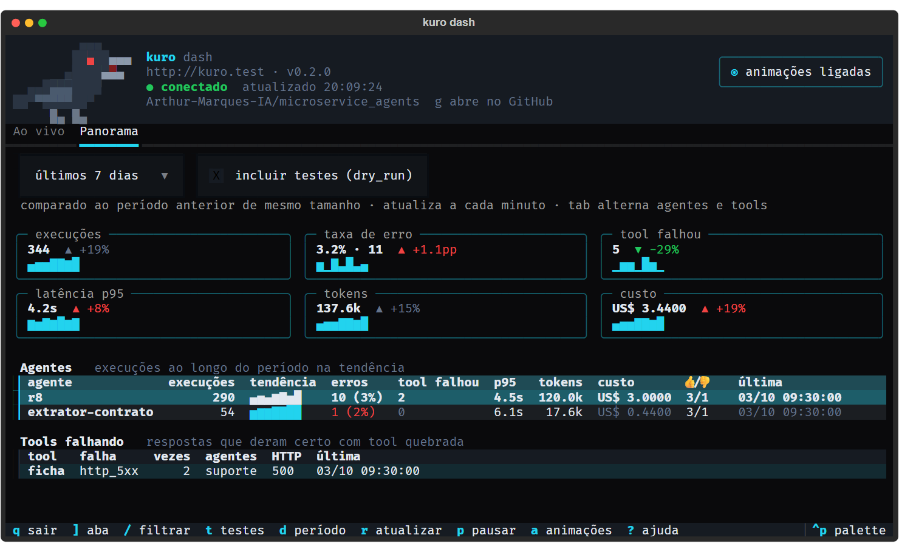
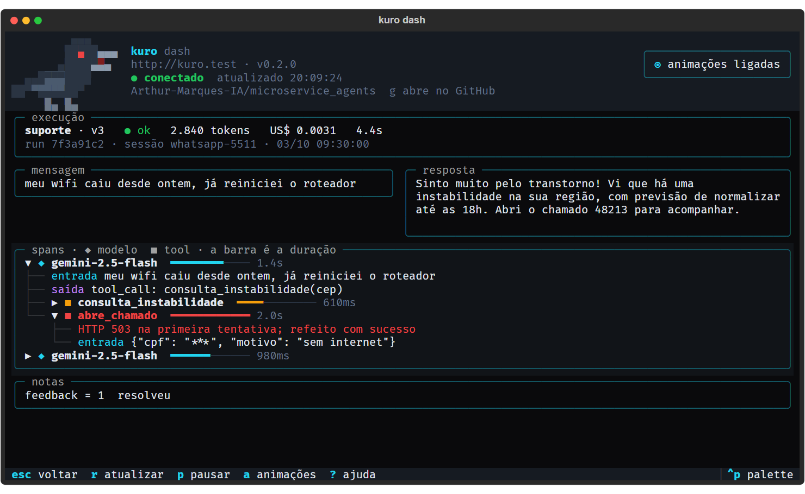

# Quickstart

Do zero ao Kuro funcionando: o serviço no ar, o primeiro agente respondendo, o painel no terminal
e um agente de IA (Claude Code) operando o Kuro pelo MCP. Leva uns 15 minutos.

Os comandos estão para Linux e macOS. No Windows, rode no Git Bash ou no WSL.

## 1. O que você precisa

- **Docker**, com o Compose, para rodar o serviço;
- **uv**, para a CLI, o painel e o MCP;
- **uma chave do Google Gemini**, o provedor padrão. OpenAI, Anthropic e Ollama também servem: veja [modelos e credenciais](conceitos.md#modelos-e-credenciais).

O uv é um único binário:

```bash
curl -LsSf https://astral.sh/uv/install.sh | sh
```

Depois de instalar, abra outro terminal, ou rode `source $HOME/.local/bin/env`, para o shell
enxergar o `uv`.

> **Sem uv?** Também dá com o pip: `python3 -m venv .venv && source .venv/bin/activate && pip
> install -e ".[tui,mcp]"`. Num Debian ou Ubuntu, o `venv` precisa do pacote
> `python3.12-venv` (`apt install python3.12-venv`). O projeto pede Python 3.12 ou mais novo.

## 2. Subir o serviço

```bash
git clone https://github.com/Arthur-Marques-IA/microservice_agents.git
cd microservice_agents
cp .env.example .env
```

No `.env`, preencha:

| Variável | O que é |
|---|---|
| `GOOGLE_API_KEY` | A chave do Gemini |
| `CREDENTIALS_ENCRYPTION_KEY` | Cifra as credenciais guardadas no banco. Gere com `uv run python -c "from cryptography.fernet import Fernet; print(Fernet.generate_key().decode())"` |
| `ADMIN_API_KEY` | A chave de quem opera: CLI, painel, MCP e console. **Sem ela o serviço fica aberto** |
| `RUNTIME_API_KEY` | A chave dos outros sistemas que chamam `/chat` e `/analyze` |

Para as duas chaves de API, qualquer texto longo e aleatório serve (`openssl rand -hex 32`).

```bash
docker compose up -d --build
```

A API sobe em `http://127.0.0.1:58000`. O console web e o Langfuse ficam desligados até você
pedir: cada um tem um profile do Compose, explicado em [operação](operacao.md).

## 3. Falar com o serviço pela CLI

A CLI, o painel e o MCP usam a chave admin. Exporte-a a partir do `.env`, para não precisar
colar a chave no histórico do shell:

```bash
export KURO_API_KEY="$(grep '^ADMIN_API_KEY=' .env | cut -d= -f2- | tr -d '"')"
```

```bash
uv run kuro health
```

O `health` mostra a versão, se a autenticação está ligada e quais provedores têm credencial. Se
ele responder 401, a chave exportada não é a mesma com que o container subiu: o container só
relê o `.env` quando é recriado (`docker compose up -d`).

> **Serviço em outra máquina?** Aponte para ela com `export KURO_API_URL=https://kuro.suaempresa.com`.
> Vale para a CLI, o painel e o MCP.

## 4. O primeiro agente

```bash
uv run kuro agents apply -f - <<'EOF'
{
  "agent_type": "suporte",
  "name": "Agente de Suporte",
  "instructions": ["Você é um agente de suporte técnico.", "Responda de forma objetiva."]
}
EOF
```

```bash
uv run kuro chat suporte -m "meu wifi caiu"
```

Mensagens seguidas continuam a mesma conversa; `--new-session` começa outra. Para outro sistema
chamar este agente, `uv run kuro agents integrate suporte` mostra o endpoint, o cURL e as
dependências obrigatórias. O contrato completo está em [integração](integracao.md).

## 5. O painel no terminal

```bash
uv run --extra tui kuro dash
```

O cabeçalho mostra o corvo do Kuro, o endereço do serviço, a versão e a conexão. O corvo dá o
estado de relance: parado quando está tudo normal, batendo as asas quando chegam execuções, com o
bico aberto e o olho vermelho quando algo dá erro, dormindo quando você pausa e de cabeça para
baixo quando o serviço não responde.

**Ao vivo** mostra o que está acontecendo agora: as últimas execuções, atualizadas sozinhas, e um
resumo do que está na tela.


**Panorama** mostra como foi o período, comparado ao período anterior: cartões com minigráficos,
uma linha por agente e as tools que estão falhando.



Enter numa execução abre o **trace**: a mensagem, a resposta e cada chamada ao modelo e às tools,
com a duração e o que entrou e saiu. Uma tool com erro já abre expandida.



Tudo se faz pelo teclado:

| Tecla | Ação |
|---|---|
| `]` / `[` | Troca de aba |
| `tab` | Alterna entre as tabelas da tela |
| `↑` `↓` ou `j` `k` | Move a seleção |
| Enter / Esc | Abre o trace / volta |
| `/` | Filtra por agente |
| `s` `t` `d` | Status, testes, período |
| `p` | Pausa a atualização |
| `a` | Liga e desliga as animações |
| `?` | Todas as teclas |
| `q` | Sai |

O resto está em [`kuro dash`](tui.md).

## 6. Ligar o MCP

O MCP dá as operações da CLI a um agente de IA como tools tipadas: o Claude Code cria, testa e
depura agentes do Kuro sem montar comandos de shell. O `kuro-mcp` roda na sua máquina e fala com o
serviço pela API, local ou remoto.

### Jeito mais rápido: o servidor gera a configuração

Se o servidor não tem domínio, ligue antes o HTTPS pelo IP. Uma vez, no servidor:

```bash
docker compose --profile ip up -d
```

Ele descobre o IP público sozinho e atende HTTPS na porta 58443, com uma CA própria. Não precisa
de domínio, das portas 80 e 443 nem de configurar o `.env`, então convive com um Traefik ou nginx
que já esteja na máquina. Se o provedor da VPS tiver firewall no painel, libere a porta 58443 lá.

Depois, ainda no servidor:

```bash
docker compose exec agent-service kuro mcp-config --show-key
```

Ele imprime, em versão bash e PowerShell, o que colar na sua máquina, uma vez:

1. um comando que salva o certificado da CA do servidor em `~/.kuro/`. Ele chega pela sua sessão
   SSH, então é o autêntico;
2. o `claude mcp add ...`, já com o endereço, a chave e o certificado.

Os comandos instalam o `kuro-mcp` direto do GitHub com `uvx`, sem clonar: na sua máquina só precisa
do uv. Sem `--show-key` a chave sai mascarada, para não ficar no histórico do terminal por descuido.

O endereço sai sozinho, nesta ordem:

| No servidor | Endereço que o MCP usa |
|---|---|
| `KURO_PUBLIC_URL=https://...` no `.env` | Esse, como está |
| `KURO_API_DOMAIN=kuro.suaempresa.com` no `.env` (profile `tls`, Let's Encrypt) | `https://kuro.suaempresa.com` |
| O profile `ip` de pé | `https://<ip-público>:58443`, com o certificado da CA para salvar |
| Nenhum dos três | `http://127.0.0.1:58000`, que só serve para um MCP rodando no próprio servidor |

`--url` sobrepõe tudo isso, para quando o serviço está atrás de outro proxy ou endereço.

### A partir do clone

Se você já tem o repositório na máquina, com o serviço local:

```bash
claude mcp add kuro --env KURO_API_URL=http://127.0.0.1:58000 --env KURO_API_KEY="$KURO_API_KEY" -- uv --directory "$PWD" run --extra mcp kuro-mcp
```

Ou, num `.mcp.json` do projeto onde seus agentes trabalham, com a chave lida do ambiente (assim o
arquivo pode ir para o git):

```json
{
  "mcpServers": {
    "kuro": {
      "command": "uv",
      "args": ["--directory", "/caminho/para/microservice_agents", "run", "--extra", "mcp", "kuro-mcp"],
      "env": {
        "KURO_API_URL": "http://127.0.0.1:58000",
        "KURO_API_KEY": "${KURO_API_KEY}"
      }
    }
  }
}
```

### Conferir

Abra o Claude Code e peça "rode o health do kuro". A tool `health` devolve a versão do serviço,
se a autenticação está ligada e os provedores com credencial. Para ver as tools sem um cliente:

```bash
npx @modelcontextprotocol/inspector uv run --extra mcp kuro-mcp
```

Duas coisas que o MCP faz diferente da CLI:

- `chat`, `analyze`, `tool_invoke` e `eval` rodam em `dry_run` por padrão: as tools recebem o
  aviso de teste e decidem o que simular;
- remover, restaurar e promover pedem confirmação à pessoa, e o agente não consegue pular isso.

Detalhes e a lista de tools em [MCP](mcp.md).

## 7. Atalho: comandos sem `uv run`

Para chamar `kuro`, `kuro dash` e `kuro-mcp` de qualquer pasta:

```bash
uv tool install -e ".[tui,mcp]"
```

Com o comando instalado, o MCP fica mais curto:

```bash
claude mcp add kuro --env KURO_API_URL=http://127.0.0.1:58000 --env KURO_API_KEY="$KURO_API_KEY" -- kuro-mcp
```

## Problemas comuns

| Sintoma | O que fazer |
|---|---|
| `uv: command not found` | Instale o uv (passo 1) e abra outro terminal |
| `ensurepip is not available` | Falta o `python3.12-venv` (`apt install python3.12-venv`); apague a `.venv` pela metade e crie de novo |
| `kuro: command not found` | Use `uv run kuro ...`, ou instale como comando (passo 7) |
| `sem permissão (HTTP 401)` | Exporte `KURO_API_KEY` com a `ADMIN_API_KEY` (passo 3) |
| MCP: `o certificado de https://... não foi aceito` | O `KURO_CA_BUNDLE` não aponta para o certificado salvo, ou a CA do servidor mudou (o volume do Caddy foi apagado): rode o `mcp-config` de novo e salve outra vez |
| MCP: conexão recusada ou expirada na porta 58443 | O profile `ip` não está de pé (`docker compose ps`), ou o firewall do provedor bloqueia a porta |
| `kuro dash` reclama de TTY | O painel precisa de um terminal interativo; num script, use `kuro runs tail --json` |
| Windows: a API demora 30 s para responder | Use `127.0.0.1`, não `localhost` (o Docker Desktop pode tentar IPv6 primeiro) |

## Próximos passos

- [Conceitos](conceitos.md): tools, base de conhecimento, memória, agentes analistas e procedurais;
- [CLI](cli.md): todos os comandos, inclusive draft → eval → promote;
- [Integração](integracao.md): como outro sistema chama o Kuro, com erros e modo shadow;
- [Operação](operacao.md): HTTPS, deploy e segurança.
