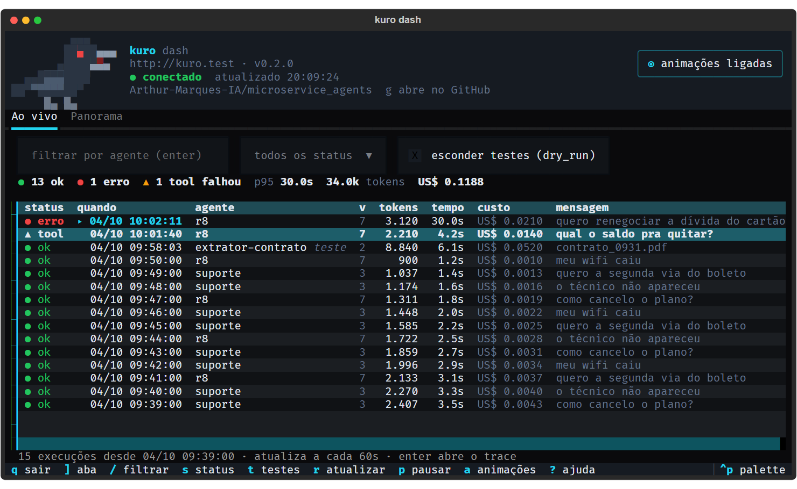
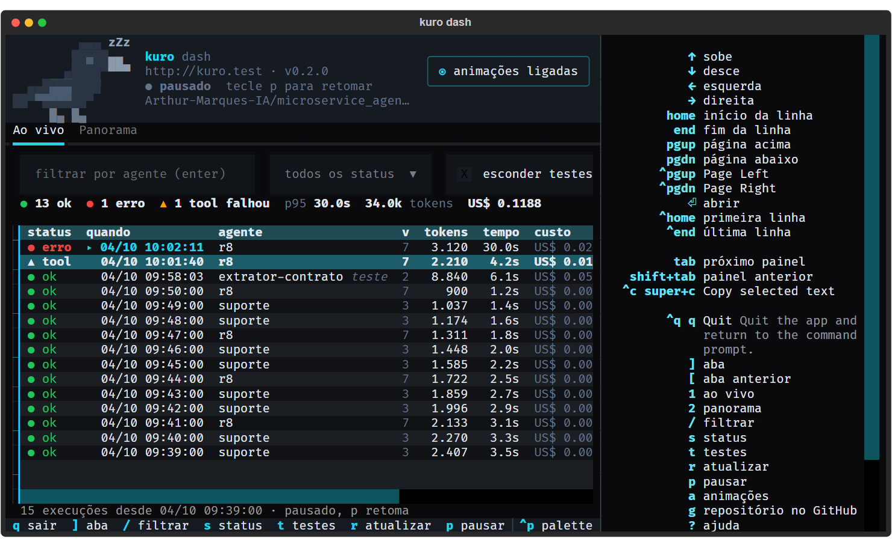

# Painel no terminal: `kuro dash`

`kuro dash` abre um painel em tela cheia no terminal. Mostra as execuções chegando ao vivo, o
trace de cada uma e o panorama do dashboard dos Logs, sem abrir o console web. Serve para quem
desligou a UI (`docker compose up -d` sem o profile `ui`) e para quem opera um serviço remoto
pelo terminal.

Como a CLI, é só mais um cliente da API: valem as mesmas flags e variáveis (`--url`/`KURO_API_URL`,
`KURO_API_KEY`, `KURO_CA_BUNDLE`), contra o serviço local ou numa VPS.



## Instalar e abrir

O painel usa o [Textual](https://textual.textualize.io) e vem no extra `tui`:

```bash
uv run --extra tui kuro dash
```

Opções:

| Opção | O que faz |
|---|---|
| `--agent r8`, `-a r8` | Começa filtrado num agente (vale também para o panorama) |
| `--interval 5` | Segundos entre as atualizações das execuções (padrão 3) |

O painel precisa de um terminal interativo. Num script ou sem TTY, use `kuro runs tail --json`.

## O cabeçalho e o corvo

No topo fica o corvo do Kuro, o endereço do serviço, a versão, o estado da conexão
(● conectado, pausado, erro na API ou offline) e o repositório no GitHub
([Arthur-Marques-IA/microservice_agents](https://github.com/Arthur-Marques-IA/microservice_agents)):
`g` abre no navegador, e nos terminais que aceitam links o texto também é clicável. O humor do corvo é o estado do painel, para
dar para saber de relance o que está acontecendo:

| Humor | Quando |
|---|---|
| Parado, de vez em quando pisca, olha para trás, bica o chão ou dá um pulinho | Tudo normal |
| Batendo as asas | Chegaram execuções novas (por uns 2 s) |
| Bico aberto, asas batendo, olho vermelho | Chegou execução com erro ou com tool falhando, ou a API respondeu erro (por uns 8 s) |
| Olhos fechados, "zZ" na cabeça | Atualização pausada (`p`) |
| De cabeça para baixo, olho × | O serviço não responde |

Abrir o painel e trocar um filtro não contam como "chegou execução": só o que aparece depois
disso. No Panorama, a falta de chave admin (403) ou o backend Langfuse (501) não deixam o
corvo em alerta: são configuração, não acontecimento.

As animações desligam no botão **animações** do cabeçalho ou na tecla `a`. Desligadas, cada
humor fica num quadro fixo. Com `TEXTUAL_ANIMATIONS=none` no ambiente, o painel já abre
com elas desligadas.

## As duas abas

**Ao vivo** (tecla `1`) responde "o que está acontecendo agora?": as 50 execuções mais
recentes, atualizadas sozinhas. Logo acima da tabela, um resumo do que está na tela: quantas
deram certo, quantas com erro, quantas com tool falhando, a latência p95, os tokens e o custo.
Cada linha mostra o status (● ok, ● erro, ▲ tool quando a resposta saiu mas alguma tool
falhou), quando (no fuso do terminal), agente, versão da configuração, tokens, tempo, custo e
o começo da mensagem. As execuções em `dry_run` levam a marca *teste*, e as que acabaram de
chegar, um ▸. Os filtros no topo:

- **agente**: digite o `agent_type` e tecle Enter;
- **status**: todos, só sucesso ou só erro;
- **esconder testes**: esconde as execuções em `dry_run`, como os testes do Playground.

Sem nenhuma execução para mostrar, a aba diz por quê: filtro sem resultado, serviço sem
execuções ainda ou o erro da consulta.

Enter numa linha abre o **trace**: o resumo da execução, a mensagem e a resposta lado a lado,
a árvore de spans (◆ chamadas ao modelo, ■ tools, com uma barra proporcional à duração e a
entrada e a saída de cada uma) e as notas. Um span com erro já abre expandido. Esc volta.

**Panorama** (tecla `2`) responde "como foi o período?", com os mesmos números da página
Logs do console (`/observability/overview`):

- cartões com execuções, taxa de erro, tool falhando, latência p95, tokens e custo, cada um
  com a variação contra o período anterior de mesmo tamanho (vermelho quando piorou, verde
  quando melhorou) e um minigráfico do período;
- uma linha por agente, com execuções, a tendência, erros, tool falhando, p95, tokens, custo
  e 👍/👎;
- as tools que estão falhando, com o tipo de falha e o status HTTP.

O período pode ser 24 horas, 7 dias ou 30 dias, com ou sem os testes. O panorama se atualiza a
cada minuto e exige uma chave de escopo admin; sem ela, a aba explica o que falta em vez de
quebrar.

## Teclas

O painel se usa inteiro pelo teclado; o mouse é opcional. O rodapé mostra só as teclas que
valem onde você está (`s` no Ao vivo, `d` no Panorama), e `?` abre a lista completa.



`tab` circula entre os **blocos de dados** da tela, não por todo campo: no Panorama, alterna
entre a tabela de agentes e a de tools; no trace, vai para a árvore de spans. O bloco com foco
fica com uma barra ciano à esquerda e o cabeçalho aceso. Os filtros têm tecla própria, e
dentro do filtro de agente as letras são texto, não atalhos.

| Tecla | Ação |
|---|---|
| `]` / `[` | Próxima aba / aba anterior |
| `1` / `2` | Vai direto ao Ao vivo / ao Panorama |
| `tab` / `shift+tab` | Próximo bloco de dados / anterior |
| `↑` `↓` ou `j` `k` | Move a seleção na tabela ou na árvore |
| Enter | Abre o trace da execução selecionada |
| Esc | Volta do trace; dentro do filtro, volta para a tabela |
| `/` | Filtra por agente (digite o `agent_type` e tecle Enter) |
| `s` | Status: todos → só sucesso → só erro (Ao vivo) |
| `t` | Esconde ou mostra os testes (`dry_run`) |
| `d` | Período: 24 h → 7 dias → 30 dias (Panorama) |
| `r` | Atualiza agora |
| `p` | Pausa e retoma a atualização automática (para ler com calma) |
| `a` | Liga e desliga as animações do corvo |
| `g` | Abre o repositório no GitHub |
| `?` | Mostra e esconde a ajuda com todas as teclas |
| `q` | Sai |

## Desenvolvimento

O código fica em `src/agent_service/tui/app.py`, e o corvo (sprites e humores) em
`src/agent_service/tui/crow.py`. Toda chamada à API roda numa thread
(`@work(thread=True)`), para uma resposta lenta não congelar a tela. Os testes
(`tests/test_tui.py`) dirigem o app com o `Pilot` do Textual, contra um cliente falso:

```bash
uv run pytest tests/test_tui.py
```
